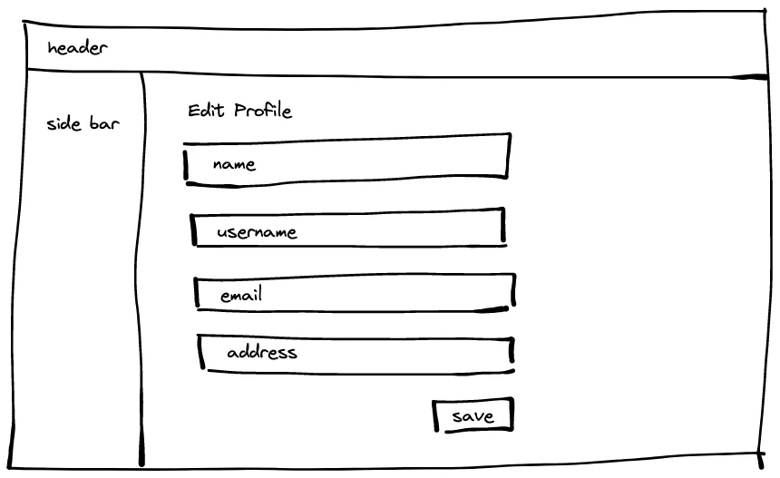
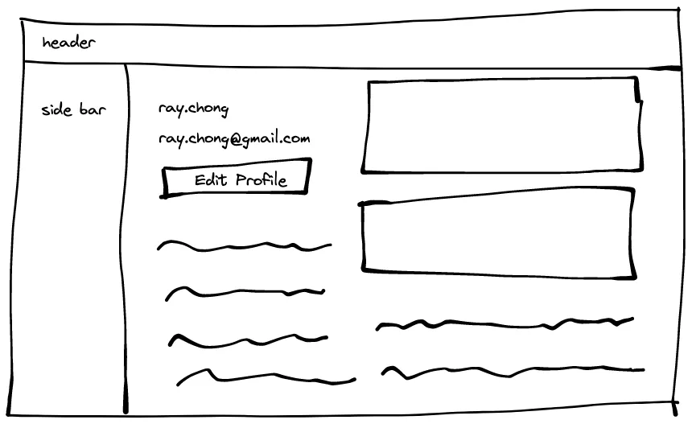

# Designing API with the Right Granularity
I discussed UI Driven API Design in my previous post. It is about the data format. This time, I am going to talk about API Granularity. When deciding on API Granularity, we still need to stand in frontend’s point of view.

Let’s take a look at the below wireframe.

This is a page to edit a user’s profile, for example, there are 4 fields to edit on this page including name, username, email, and address. When the user enters this page, frontend needs to invoke the backend’s API to retrieve the data for name, username, email, and address. After clicking the save button, it will call the Edit Profile API to update the data. So, for this page, actually we need two APIs for frontend.

Now, we have another page called My Profile. It displays basic user information like username and email only. Other information is something related to the user like order history, payment history, etc.

It looks like we can reuse the previous API that is in use on the Edit Profile page to retrieve the user profile. Would you do this? Let’s take a bit of time to think about it.

Some backend engineers create coarse-grained API to fit the frontend use cases as more as possible. That said, they don’t need to maintain different endpoints in the backend instead they just maintain a coarse-grained endpoint and let the frontend developer choose the data they need.

Another type of engineer, they create fine-grained API to fit the particular use case in the frontend which is what I mentioned before, UI Driven API Design. This type of engineer will create an endpoint according to the UI design. If we use the above example, this type of engineer will definitely create another API that only returns username and email to the frontend.

Is it good to return all the data to the frontend and let the frontend reuse that API and choose the data that they need? Personally, my answer is no.

Let’s stand from a frontend developer’s angle to look at compare the coarse-grained and fine-grained API.

If we use coarse-grained API, let’s say we return 10 fields but the frontend only needs 2 fields. The frontend developer might confuse why does the backend developer return 10 fields to me? What fields should I use? It might increase some extra communication costs between the frontend and the backend. But if we use fine-grained API and only return 2 fields, the frontend developer will know which field they need to use because there is no extra noise in the API response.

Fine-grained API is not a silver bullet, for example, we need to manage a lot of similar endpoints if we have a lot of similar use cases in the frontend. But if your system scale is that large, then you might consider other technologies to solve this complexity instead of using RESTful API.

 

<link href="https://fonts.googleapis.com/css?family=Cookie" rel="stylesheet"><a class="bmc-button" target="_blank" href="https://www.buymeacoffee.com/raychongtk">Buy me a coffee</a>

