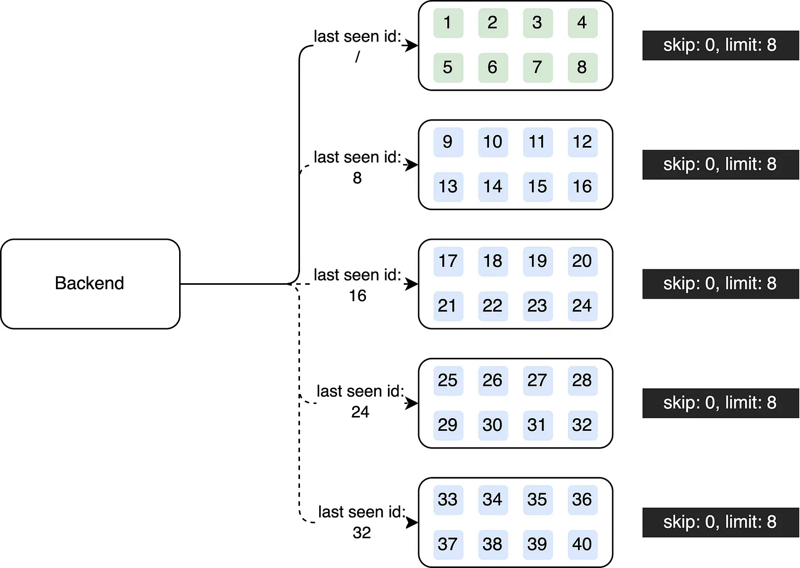

# Do You Use Pagination Right?
Pagination is a valuable approach for enhancing data retrieval performance. In a previous post, I discussed the implementation of Pagination in API design. However, it's important to be aware of a potential pitfall associated with this pagination technique. In software engineering, there are two primary types of Pagination: Offset-based Pagination and Cursor-based Pagination.

## Offset-based Pagination

Offset-based pagination, the technique I previously introduced, offers simplicity in design and flexibility for navigating to any desired page.


This visualizes how offset-based pagination navigates pages. With this design, users can simply jump to any page that they want.


```sql
select * from target_table where x > y order by id skip 0 limit 8;

select * from target_table where x > y order by id skip 8 limit 8;

select * from target_table where x > y order by id skip 16 limit 8;

select * from target_table where x > y order by id skip 24 limit 8;

select * from target_table where x > y order by id skip 32 limit 8;
```

However, as the offset value increases, retrieving subsequent pages becomes slower. This is because each retrieval requires skipping a certain number of records, resulting in performance degradation. This impact can be especially obvious when working with large datasets or when the offset values are high. It's crucial to consider these limitations and explore alternative pagination techniques to mitigate the performance issues associated with offset-based pagination.

>If your system uses offset-based pagination and suffer performance issues, you should talk to your product manager to set a limitation on how deep a user can navigate between pages. The more pages that a user skips, the slower the response is.
>
>Or, consider using the below alternative to design pagination.

## Cursor-based Pagination

To address these challenges, an alternative pagination approach called cursor-based pagination emerges as a viable solution. Unlike offset-based pagination, cursor-based pagination offers improved performance and stability by leveraging unique cursor values associated with each record. It enables more efficient and consistent queries, especially when dealing with large datasets.


In cursor-based pagination, random page navigation is not allowed. Instead, only linear access is allowed in this design which users can only navigate to the previous page or the next page. It can provide better performance compared to offset-based pagination, especially when dealing with large datasets.



```sql
select * from target_table where x > y order by id limit 8;

select * from target_table where x > y and id > 8 order by id limit 8;

select * from target_table where x > y and id > 16 order by id limit 8;

select * from target_table where x > y and id > 24 order by id limit 8;

select * from target_table where x > y and id > 32 order by id limit 8;
```

However, it's important to note that implementing cursor-based pagination can introduce additional complexity compared to offset-based pagination. Maintaining and managing unique cursor values for each record requires careful consideration to ensure their integrity and uniqueness throughout the pagination process.

>jOOQ did a comparison for the performance. If you are interested in the detailed comparison, go check out this blog.Ref: https://blog.jooq.org/faster-sql-paging-with-jooq-using-the-seek-method/

## Conclusion
When deciding which pagination technique to employ, it's crucial to evaluate the specific requirements and characteristics of your application. Consider factors such as dataset size, user navigation patterns, and the trade-offs between performance and implementation complexity. By carefully analyzing these factors, you can determine the most suitable pagination approach for optimizing data retrieval performance in your software system.