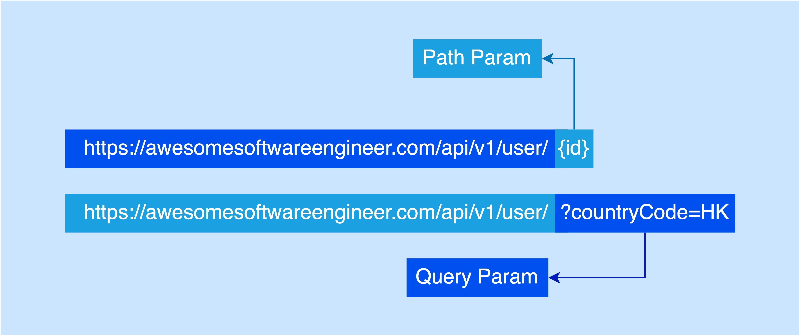

# Everything About RESTful API
Today, I’ll be covering the topic of RESTful API design. In this post, I will focus on RESTful API design. I will not compare RPC and RESTful that many. Okay, let’s get started!

RESTful is an API development style that focuses on resources. Compared to the RPC style, there is a difference between these two approaches. RESTful is a resource-based style while RPC is an action-based style. For example, if you want to delete a user, your API might look like this:

>RESTful: /api/user/1 with HTTP method DELETE
>
>RPC: ?action=deleteUser&id=1 with HTTP method POST/GET

Personally, I think RESTful is more clean and simple compared to RPC. The core concept of RESTful is that using the HTTP methods to replace the action verb and the URL path can focus on the resource itself. If the APIs are related to CRUD (create, read, update, delete), then RESTful will be your best friend. Because RESTful is a CRUD-friendly and resource-oriented development style.

## Stateless

RESTful API is stateless. That said, the server does not need to store any state. The client will provide all the information for the server to understand it. This design helps the application to scale easily because each request response is independent. It means there is no dependency on a specific backend application and we can scale the backend applications to support more traffic easily.

## Resource

I mentioned the word “Resource” many times, so what is a resource?

Basically, a resource means a business domain in your project and it must be a noun. For example, the user can be a resource, and the order can be another resource. It depends on how you split the business into different domains. After that, you need CRUD operations to support these domains. In RESTful API style, CRUD will map to the following HTTP methods: GET, POST, PUT, PATCH, and DELETE.

### GET

GET is used for making a Read request to the server and it is idempotent. For example, /api/user/1 with GET HTTP method will return the id 1 user back to the client. Instead of using path param, we can also use query param for the advanced query.

### POST

POST is used for making a Create request to the server. Every time you make a POST request, it will create a resource in the server. For example, /api/user with POST HTTP method and request body will create a new user.

### PUT

PUT is used for making an Update request to the server and it is idempotent. Concretely, PUT is referring to replacing a resource. That said, the incoming request will replace the whole existing resource. For example, /api/user/1 with PUT HTTP method and request body will replace the id 1 user in the database. If you have 5 fields in the user domain, then they will be replaced by the incoming request.

### PATCH

PATCH is used for making an Update request to the server but it is different from PUT and it is not designed to be idempotent. A patch request, it is used to update particular fields in a domain. For example, updating the email address from a user domain. Only email will be sent in the request body. The URL might look like this: /api/user/1 with PATCH HTTP method.

### DELETE

DELETE is used for making a Delete request to the server and it is idempotent. Sending a request like this /api/user/1 with HTTP method DELETE will delete the id 1 user in the database.

## HTTP Response Status Code

RESTful uses HTTP status codes to identify the API status. For example, 200 (OK), 201 (Created), 204 (No Content), 400 (Bad Request), 500 (Internal Server Error), etc.

To understand more about HTTP Response Status Code, you can refer to Mozilla.

Personally, I think don't struggle with semantics. After you learn the semantics of the HTTP methods and the RESTful convention, you should think about how to utilize it for better API design instead of struggling with literal meaning. Never take a theory as dogma because there are always exceptional cases. For example, what HTTP method will you use for the login API? How about search API?

These scenarios are not just simple CRUD operations, you can’t use the above theory to adopt the HTTP method. 

For the login scenario, POST is acceptable because we need to put the login credentials into the request body for security reasons.

> How about the search scenario? I’ll leave it for you.

## Query Param vs Path Param

I’ve mentioned the query param and path param above, here is a visualization for you in case you don’t know what is query param and path param.

In general, a unique identifier will be placed in the path param to identify a resource. For query param, it is for conditional searching in most of the scenarios.

## Idempotency

I’ve mentioned “idempotent” many times. You may have a doubt about this word. I have the same feeling back in 2019 when I was a fresh graduate. Actually, idempotency is used to describe whether an API is capable for retry or not after an API request failed. If an API is idempotent (GET, PUT, or DELETE), it means you can retry the API anytime. That said, no matter how many times you send identical requests to the server, it will always return the same result (no side effect).

## HATEOAS (Hypermedia as the Engine of Application State)

There is a technique called HATEOAS-driven RESTful API. Simply put, it is a mechanism to allow the client to dynamically navigate to the resources based on the response header. That said, the API response will tell the client what is the next step after calling the API.

## Conclusion
To sum up, I think the core spirit of RESTful API design is how you utilize the URI to describe the resource relationship and level and make use of the HTTP convention to further describe the action of the API. Also, there is no best API development approach, it will be the best only when it is the best option for the scenario.

 

<link href="https://fonts.googleapis.com/css?family=Cookie" rel="stylesheet"><a class="bmc-button" target="_blank" href="https://www.buymeacoffee.com/raychongtk">Buy me a coffee</a>

