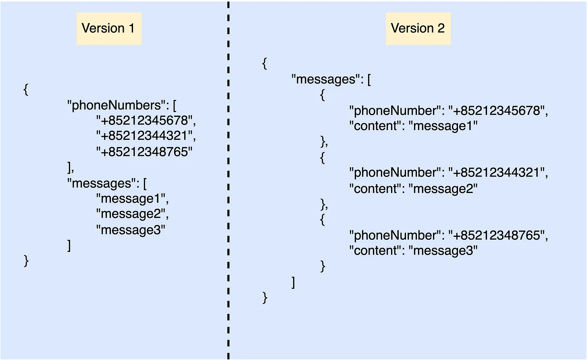

# How to Handle API Backward Compatibility?
Handling backward compatibility is super important in modern software development. Without backward compatibility, a system cannot support zero downtime deployment.

To handle backward compatibility, I can simply categorize the solutions into these 3 types in general.

## Create a new flow

Creating a new flow and making multiple versions available for an API is one of the techniques to handle backward compatibility.

With a new API version, the backend is able to support multiple versions at the same time. If the users are using an old client, the requests will be sent to the previous version. If they already updated the new client, then the requests will send to the new version.

This approach is suitable for the use case that the whole API data structure or behavior is completely changed. For example, we have an API to send SMS messages to different receivers. In our first API iteration, we use a flattened data structure to represent multiple messages. After a few iterations, we decided to make the API contract more intuitive to reduce cognitive load. So, we want to iterate our API design and change the API contract.

What will happen if we change the existing API contract directly? The old client will be gone. Because we no longer support the old API contract. This will affect all the old clients and it is not acceptable in modern software development.

So, how can we do better? Create a new flow and deprecate the old API contract but still support it for a period.

In the above design, we need to support these 2 versions running in production at the same time until your team decided to remove Version 1 completely. With this design, the old client will send requests to Version 1 and the new client will send requests to Version 2. That said, we don’t need to affect the traffic that is sent from the old client and created a new flow to support the new client.

## Make a new data field optional

Another use case is that the data structure remains the same but we want to add a new field to the API contract. In this scenario, we can just simply add a new field to the API contract and keep it optional. By doing this, we can check if the request has assigned a value to this new field or not to determine whether we need to run a special logic to support this new behavior. The requests from the old client do not need to run the special logic related to the new field.

## Give a new data field a default value

This approach is quite similar to the second option. The only difference is that we already have the value for the new field even if API consumers didn’t assign any. For example, we want to add a new field called subscriptionType. Because you want to change your business model from completely free to support both free and premium users. So, this field will be an enum value containing FREE and PREMIUM. In this scenario, we already know the existing users are in FREE subscription model, so we can simply assign FREE as the default value for the subscriptionType. If the request payload does not assign any value to subscriptionType, by default it will be FREE. With this approach, even if we introduce a new data field, it will not affect the existing users. Because the API behavior is updated seamlessly inside the backend without bothering users.

## Conclusion
Let’s wrap it up. Backward compatibility is important for modern software development and every software engineer has to care about making API backward compatible. Without backward compatibility, your users will complain about your service because every time you make a new change in the API contract will affect the existing users directly and they know you are doing something wrong. It will hurt your professional image and the reliability of your service.

 

<link href="https://fonts.googleapis.com/css?family=Cookie" rel="stylesheet"><a class="bmc-button" target="_blank" href="https://www.buymeacoffee.com/raychongtk">Buy me a coffee</a>

