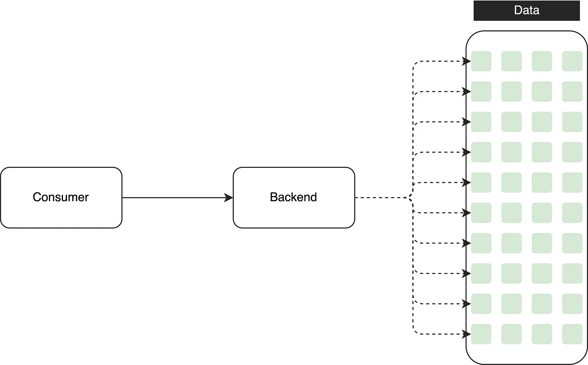
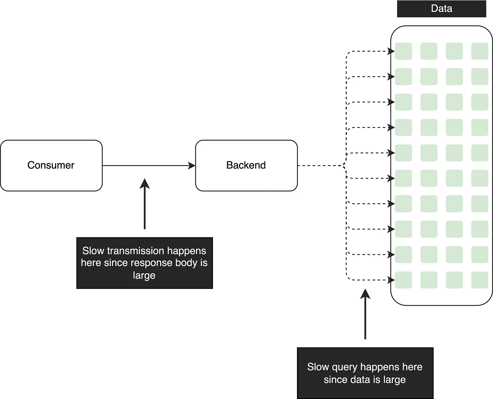
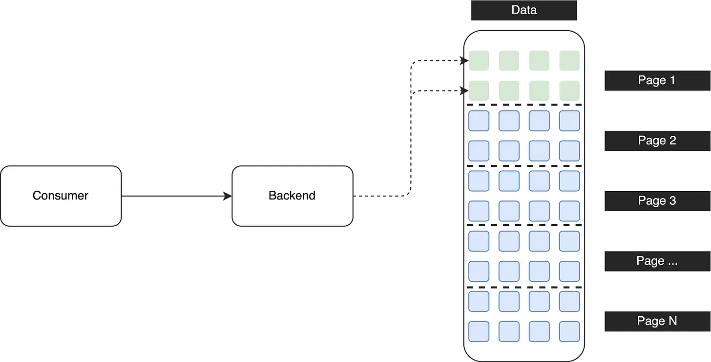
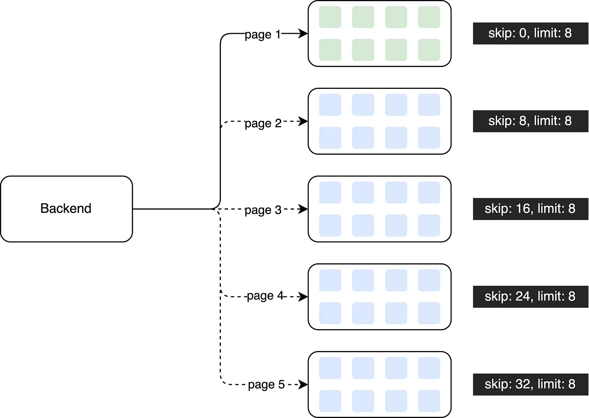

# Improve Performance When Retrieving Large Dataset
In the realm of software development, backend systems store vast amounts of data, and it is the responsibility of software engineers to design APIs that retrieve this data from databases.

When dealing with small datasets, some novice engineers may design APIs that fetch all the data from the database in a single operation. This approach works fine with small data sizes since it doesn't lead to performance issues.

However, when the database contains millions of records, retrieving all the data in one go can result in slow query performance or even OOM. Slow API responses not only hinder user experience but also undermine the reliability of the API, potentially eroding customer trust.

To address this issue and improve performance, a recommended solution is to redesign the API using pagination.

In this enhanced design, a large dataset is divided into smaller chunks, and the data is retrieved incrementally using pagination. For instance, the first API call fetches the first 8 records from the initial page. If users need to access the second page, another API call is made to retrieve that specific page.

By adopting this approach, the API retrieval performance can be optimized. In contrast to the previous method, which retrieved the entire dataset at once, the improved design fetches only 8 records per API call, effectively controlling the data size and enhancing performance.

> 💡 Do you know what’s the hidden performance issue with using this type of pagination? Share your thoughts in the comment section!

In summary, pagination is a technique that divides large datasets into manageable pages, improving retrieval performance, controlling data size, and enhancing the user experience when dealing with substantial amounts of data.

 

<link href="https://fonts.googleapis.com/css?family=Cookie" rel="stylesheet"><a class="bmc-button" target="_blank" href="https://www.buymeacoffee.com/raychongtk">Buy me a coffee</a>

