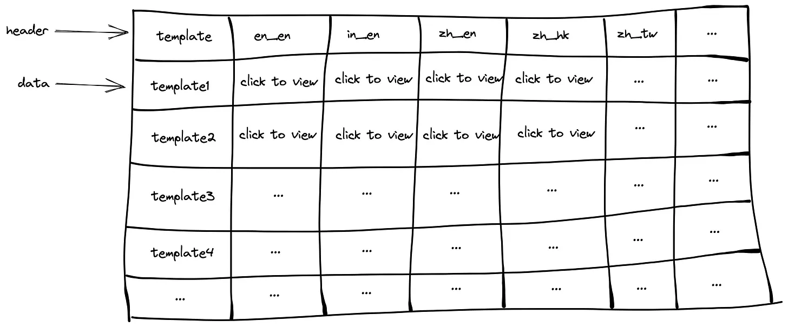

# Let UI Drive API Design
API development is a day-to-day routine for every backend developer. When developing API for frontend developers, what approach will you use? 

This is really important when backend developers collaborate with frontend developers. If the API contract is convenient, then it will facilitate frontend developers’ work and provide a better developer experience.

To explain more about the API development approach, let's take the below UI as an example:

Imagine we have a page with a basic table in the frontend. In this table, each row is a template and each template has multiple translations for different languages. That said, each column is a translation for that template. When a user clicks the “click to view” button, it will display the translation content.

So, how do backend developers store the template data in the database? Let’s keep everything simple. We don’t consider normalization and other functionalities. We just focus on the template.

Based on this table design, each row will be a template translation. If we search the template by template_id, we can get all the translations for this template.

Now, the problem is how would you design a good API contract for the frontend developers?

Would you design the API like this? This design is using data to drive the API design. Each JSON object is a row in the database and eventually, we return a list of templates to the frontend.

Do you think it is a good design? Yes or no. If you are frontend developer and the backend guy gives you this API contract and you look at the UI design, I think the first thing that comes to your mind is to aggregate the data. Because this design does not have any data aggregation, it is just purely retrieving data from the database and returning it to the frontend.

From the frontend developers’ perspective, they don’t care how the backend stores the data as long as it is reliable and correct. When the frontend receives the data, the frontend developer needs to do the aggregation in order to fit the UI design. It seems a bit weird. Should frontend do this aggregation? My answer is no.

Using this design, the developer experience for the frontend developers is bad and the API itself is not intuitive from a UI perspective.

Personally, when I develop APIs, I will start from a UI perspective in terms of providing a better developer experience for frontend developers and making them happy. Because they are the API consumer, as a backend developer, I need to make them feel convenient when using my APIs. I don’t know whether there is terminology for this approach or not but I will call it UI Driven API Design.

If we look at the diagram above, we can know there is User Experience and Developer Experience between different layers. From user to UI, that is User Experience. On the other hand, there is a Developer Experience between UI and API. The user experience drives the UI and the developer experience drives the API. That said, If the backend developers can help to aggregate the data and provide a better API shape to the frontend developers, we can optimize the developer experience for the frontend developers.

So we need to let the UI drive the API design. If we look at the first diagram, we can know the data is aggregated by the template. Each row is a template followed by different translations. With this UI presentation, we can reshape the API contract to the below format.

Using this approach, the backend API already helped the frontend developer aggregates the data by template and the frontend developer can use the data directly without aggregating the data in the frontend. Now, each template will get a list of translations in the API contract. It seems to be more intuitive from a UI perspective.

With this API contract, each field is a template and contains a list of translations. When the user clicks the translation button to view the translation, the frontend developer can get the translation content from the list by index. Also, the frontend developer can get the correct row by looking up the template id (key) in the map data structure to get the list of translations (value).

Let’s wrap it up. When designing API, try to understand the developer usage habits or UI and talk to your consumers to understand their needs. Always start from the API consumers’ side, it will help you design a better API contract.

> Do you have any other ideas to improve the developer experience between Frontend and Backend? Share your ideas in the comment section!

