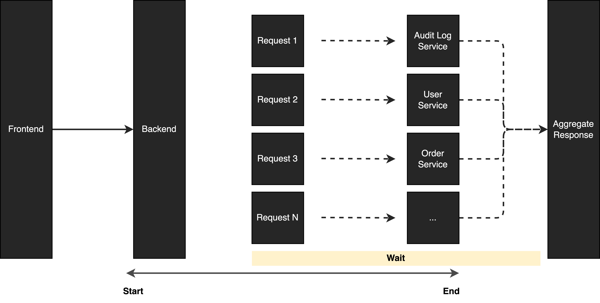

# Optimize API Performance Through Parallelization
Parallelization is useful in such a scenario where a single request from the frontend needs N requests in the backend to compose the data that the frontend needs.

Imagine when internal users trigger a “create order” request in an internal portal, and the “create order” request involves 10 requests from different microservices to complete the action. If one request takes 1 second to complete, it takes 10 seconds in this case.

Triggering a request in the frontend and taking 10 seconds to respond back to the frontend is really hurting UX a lot.

Let’s take a step back. Do we really need to execute the requests sequentially? The requests do not have a dependency, they can all be executed in parallel. In this case, if we change the design to parallel requests, the performance will be improved significantly.

With parallel requests design, every request is assigned to a dedicated thread and executed concurrently. After submitting to a thread pool, the program waits for all the results to come back. When all the requests are completed, the program aggregates the response and returns it back to the frontend. In this case, 10 seconds waiting time can be reduced to 1 second in the best case as we don’t need to execute the request one by one. Instead, we execute the 10 requests to 10 different services simultaneously.

What if we have a dependency between some requests? In this case, we can mix serialization and parallelization together.

When mixing serialization and parallelization together, we can still optimize the processing time a lot. But this is not going to work when the requests are tightly coupled with each other. Because you always need to wait for a response in order to proceed with the logic flow. In this case, you may consider other optimization strategies.

In summary, if you have an API that needs to integrate with many services and they don’t have a dependency on each other. You can consider this optimization approach in order to reduce the waiting time.

 

<link href="https://fonts.googleapis.com/css?family=Cookie" rel="stylesheet"><a class="bmc-button" target="_blank" href="https://www.buymeacoffee.com/raychongtk">Buy me a coffee</a>

