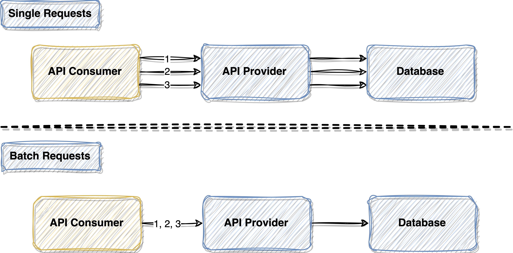
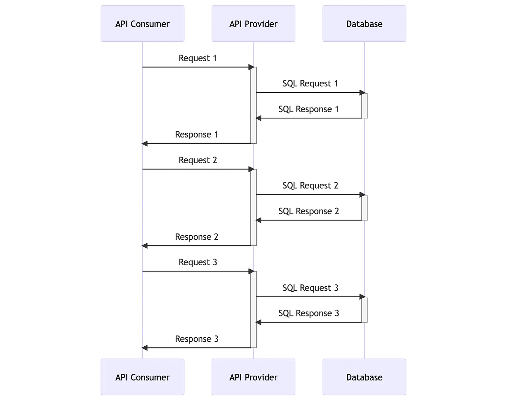
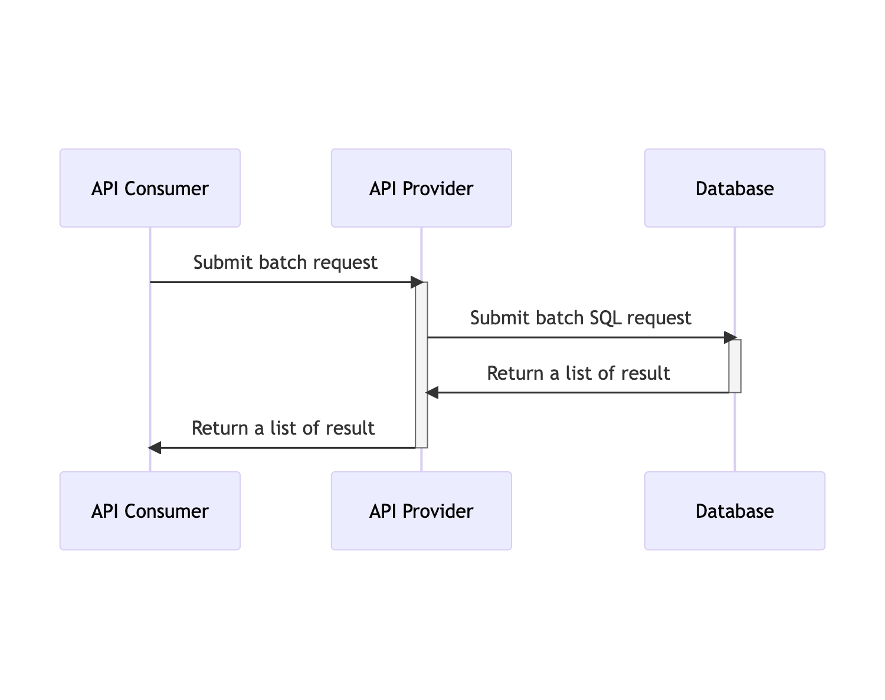
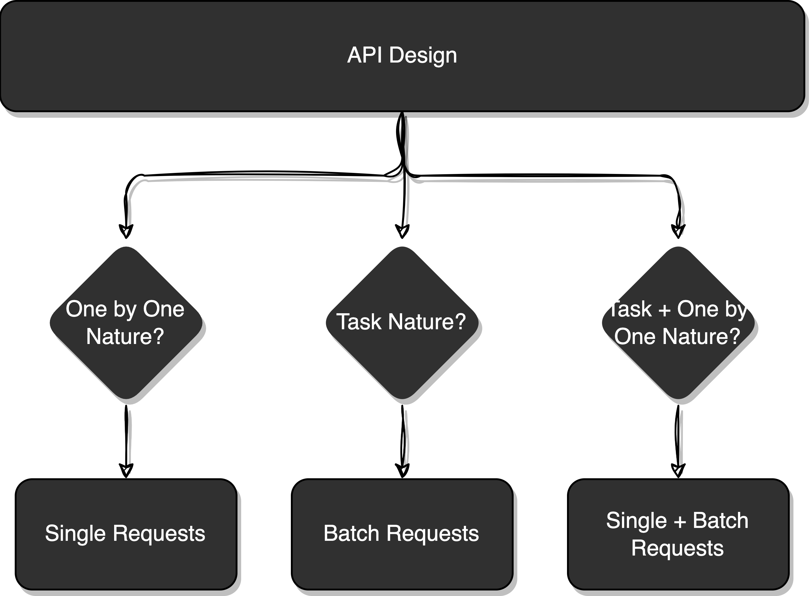

# Enhancing API Performance Through Batch Requests
When designing an API, tailoring it to the specific use case is of utmost importance. This involves considering two primary design approaches: Single Requests and Batch Requests. Each approach has its own set of advantages and disadvantages, and making the right choice depends on the scenarios you encounter.

## Single Requests

In the Single Requests approach, API consumers initiate multiple requests independently. For instance, if you need to send inbox notifications to various users, under this design, each request must be sent one after the other. However, this method may not be the most efficient. Each request incurs network overhead and necessitates waiting for individual responses. Particularly in scenarios where the same request needs to be repeatedly sent to the API provider, this approach becomes inefficient and resource-intensive.

## Batch Requests

On the other hand, the Batch Requests design streamlines the process. When, for instance, inbox notifications need to be sent to a hundred users, this approach requires only a single invocation of the notification API. This optimizes network overhead significantly. Yet, it introduces complexities, such as managing invalid requests within the batch and the intricacies of the overall design. Error handling and determining the source of failures become more intricate when compared to the Single Requests design.

## The Right Choice

Choosing between these two approaches isn't straightforward and depends on the specific context. Neither approach is universally superior; rather, each has its strengths for particular use cases. The decision hinges on factors such as the nature of the operations, the frequency of requests, and the balance between network efficiency and design complexity.

This is a simplified mental model that could help you choose the right API design. To find the optimal solution, consider a hybrid approach. Employ Single Requests for simple, critical operations, and leverage Batch Requests for tasks involving a large volume of requests that can benefit from reduced network overhead. Ultimately, the best approach aligns with your application's unique requirements and goals.

 

<link href="https://fonts.googleapis.com/css?family=Cookie" rel="stylesheet"><a class="bmc-button" target="_blank" href="https://www.buymeacoffee.com/raychongtk">Buy me a coffee</a>

