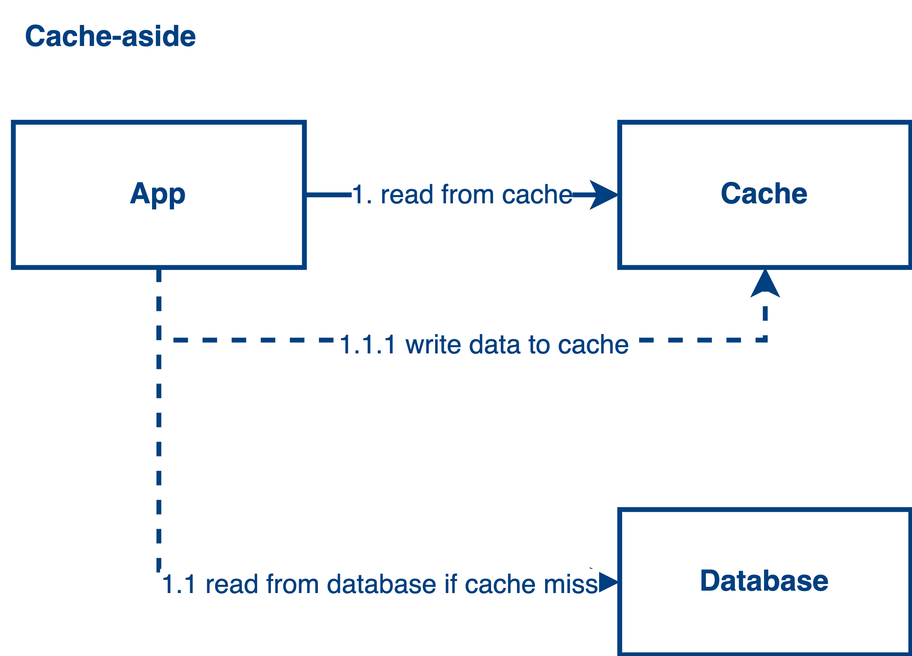
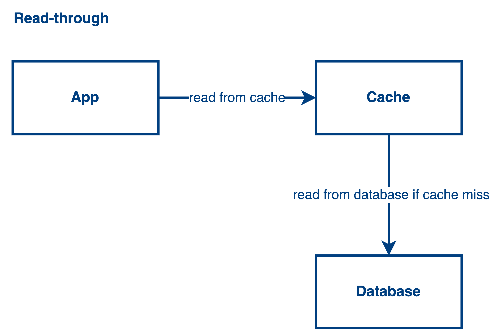
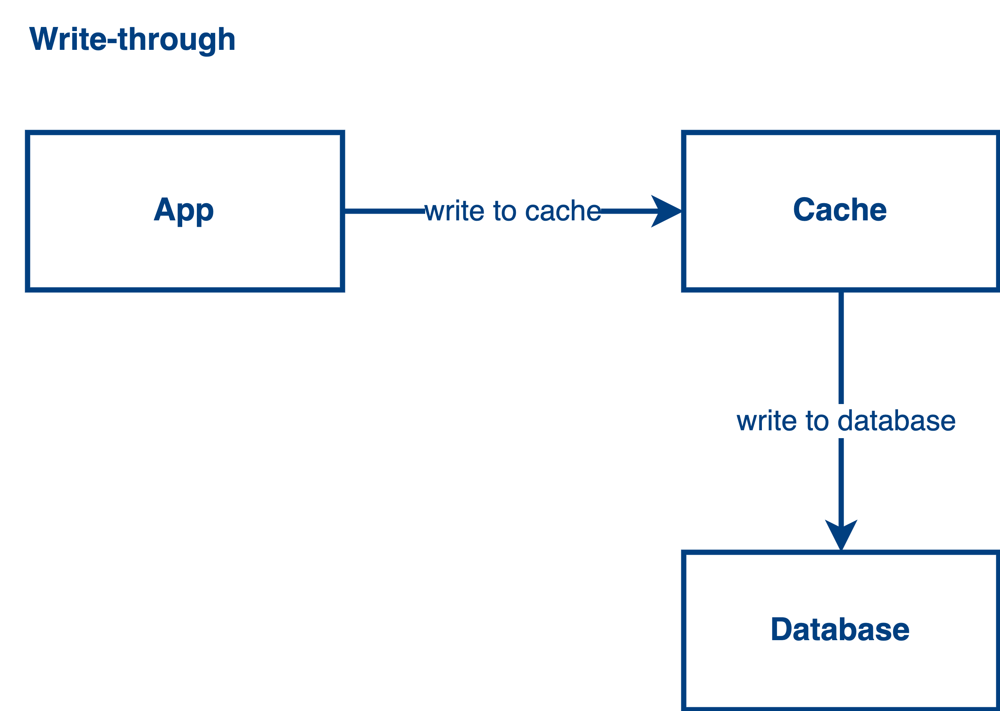
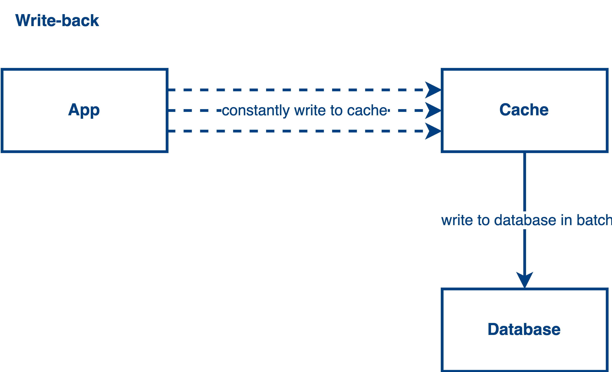

# 4 Popular Cache Patterns
In this post, we’ll cover 4 popular cache patterns including Cache-aside, Read-through, Write-through, and Write-back patterns. The application performance will be improved a lot if you choose the right cache strategy. Let’s jump into the topic.

## Cache-aside

The cache-aside pattern is good for the read-heavy scenario. The control of reading from cache or database is on the application side. Your application controls the flow of reading data. If a cache is hit, read the data from the cache, otherwise, read the data from the database and write the data back to the cache. There is a data inconsistency issue under this design since the data is written to the database directly. After writing the data to the database,  the cache does not know the value in the database gets updated. To solve this problem, we usually delete the cache key after we write to the database or we can use cache write strategies.

Example: Redis

#### Side Topic

> Do you know why we don't remove the cache key first and write to the database afterward?

## Read-through

The read-through pattern is also good for the read-heavy scenario. The idea in this pattern is quite similar to the cache-aside pattern. The only difference is that the flow of reading data is controlled by the cache library instead of your application. That said, your application only needs to read the data from the cache directly and the cache library will help you manage all the stuff related to cache hit or cache miss. In this pattern, we have the same issue that faced in the cache-aside pattern.

> Example: Apache Ignite, Amazon DynamoDB Accelerator

## Write-through

With the write-through pattern, the data is first written into the cache and the cache library will help us sync the data to the database. Your application will not touch the database directly. Instead, every write will go through the cache. This will introduce a bit of latency during the data propagation. To solve this problem, the write-through pattern is always put together with the read-through pattern. It can solve the problem in the read-through or cache-aside pattern. Also, the read-through pattern solves the latency problem in the write-through pattern as well because now the data read and write is always in the cache.

> Example: Apache Ignite, Amazon DynamoDB Accelerator

## Write-back

The write-back pattern is good for the write-heavy scenario. With this pattern, the data will be constantly written into the cache. After a certain time, the cache will be written back to the database once. It can reduce the overall write to the database and mitigate database workload. It facilitates the application performance when you are in a write-heavy use case but it does give some drawbacks like data inconsistency and data loss if the cache is down and the data haven’t been written back to the backing store.

To mitigate the problems from the write-back pattern, simply we can combine the read-through pattern to access the latest data in the cache to solve the consistency problem. Also, we can put more replicas to mitigate the situation of potential data loss.

> Example: Apache Ignite, Amazon DynamoDB Accelerator, Redis

### Case study

> I was asked to solve a problem with a write-heavy scenario in an interview. It was related to frequent geolocation updates and the use case is writing a lot of user locations into the database frequently, because of frequent updates, the database becomes a bottleneck. I was using the write-back strategy to solve this problem back then because the use case does not need a real-time behavior. That said, latency is accepted in that situation, so the write-back strategy is one of the possible solutions for that.

## References
- https://aws.amazon.com/blogs/database/amazon-dynamodb-accelerator-dax-a-read-throughwrite-through-cache-for-dynamodb/
- https://ignite.apache.org/docs/latest/persistence/external-storage

 

<link href="https://fonts.googleapis.com/css?family=Cookie" rel="stylesheet"><a class="bmc-button" target="_blank" href="https://www.buymeacoffee.com/raychongtk">Buy me a coffee</a>

