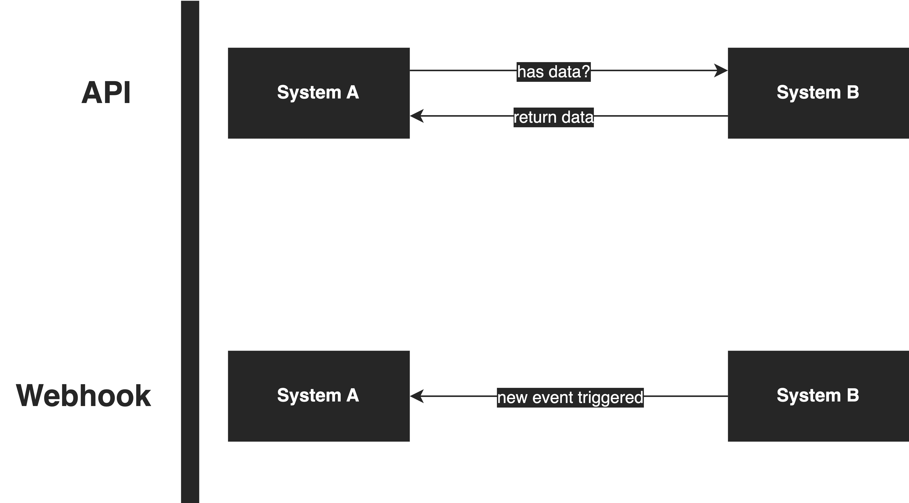

# API vs Webhook
I guess so many engineers from the tech industry were confused by API and Webhook. Today, I will explain this topic and clear your doubt.

Imagine System A is your application and System B is an external system that your system depends on. Now, System A needs the data from System B to process its business logic, in general, it will be a status of a record. Now, let’s compare API and Webhook.

## API

If System B provides an API for System A to query its data, System A will need to control when to query System B and System B might not have data when System A invokes the API. That said, it is an HTTP request-response pattern.

Every time System A invokes System B, there are 2 possible results; containing data or nothing. If there is data in the response, System A will do some processing according to the data to execute its own business logic. If not, System A will ignore it and wait for the next invocation.

> Do you know what are the problems in this approach? I'll leave it to you. Think about it.

## Webhook

Using Webhook, System A does not rely on the HTTP request-response pattern and System B does not need to provide an API for System A. Instead, System A will provide an API for System B as a Webhook invocation.

Yeah... Actually, Webhook is just an API but the position between System A and System B is reversed. Now, the API provider is not System B but System A. That said, System A does not need to care when it needs to invoke System B. Instead, it just provides an endpoint for System B to send events.

Every time something changed on System B, it will send an event to the Webhook URL, and System A will receive it and do its own business handling.

The Webhook technique is quite common in some SaaS providers like Stripe, Github, SendGrid, etc. Because when sending data to these services, your system needs to know the status of your records and do some business handling accordingly.

## Security Brainstorm

Now, your system is the API provider, so you need a mature approach to authenticate the incoming requests, else everyone can push notifications to your system via the Webhook.

Basically, a common authentication approach is to use a data signature approach. In our use case, System B will provide some rules for System A to verify that the requests are from System B.

For details please refer to [Stripe Webhook Signature](https://stripe.com/docs/webhooks)

## Conclusion
Let’s wrap it up. The main difference between API and Webhook is the interaction approach. API is a pull model and Webhook is a push model. Webhook makes the service provider proactively share the information that their client needs but API does not. Choosing API and Webhook wisely can help to improve your system stability and resource utilization.

 

<link href="https://fonts.googleapis.com/css?family=Cookie" rel="stylesheet"><a class="bmc-button" target="_blank" href="https://www.buymeacoffee.com/raychongtk">Buy me a coffee</a>

