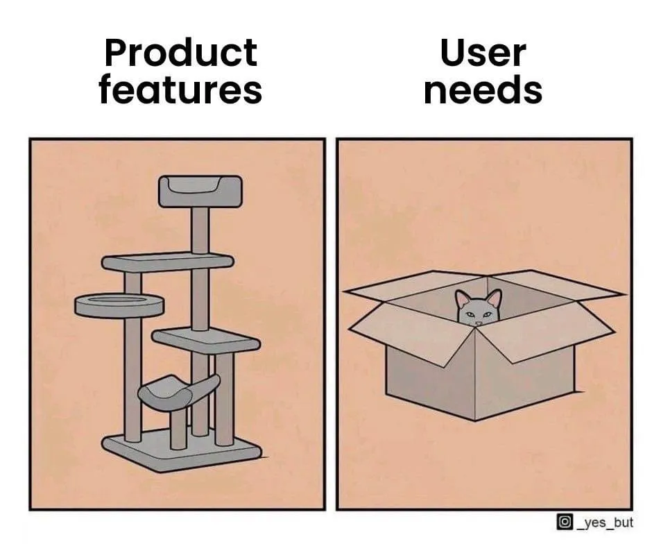
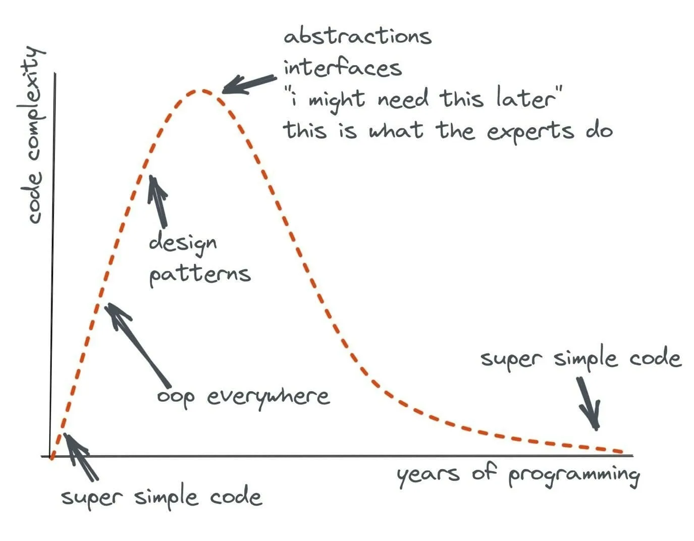
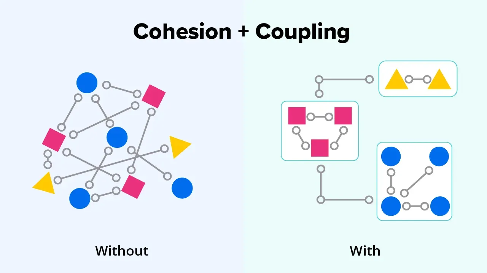
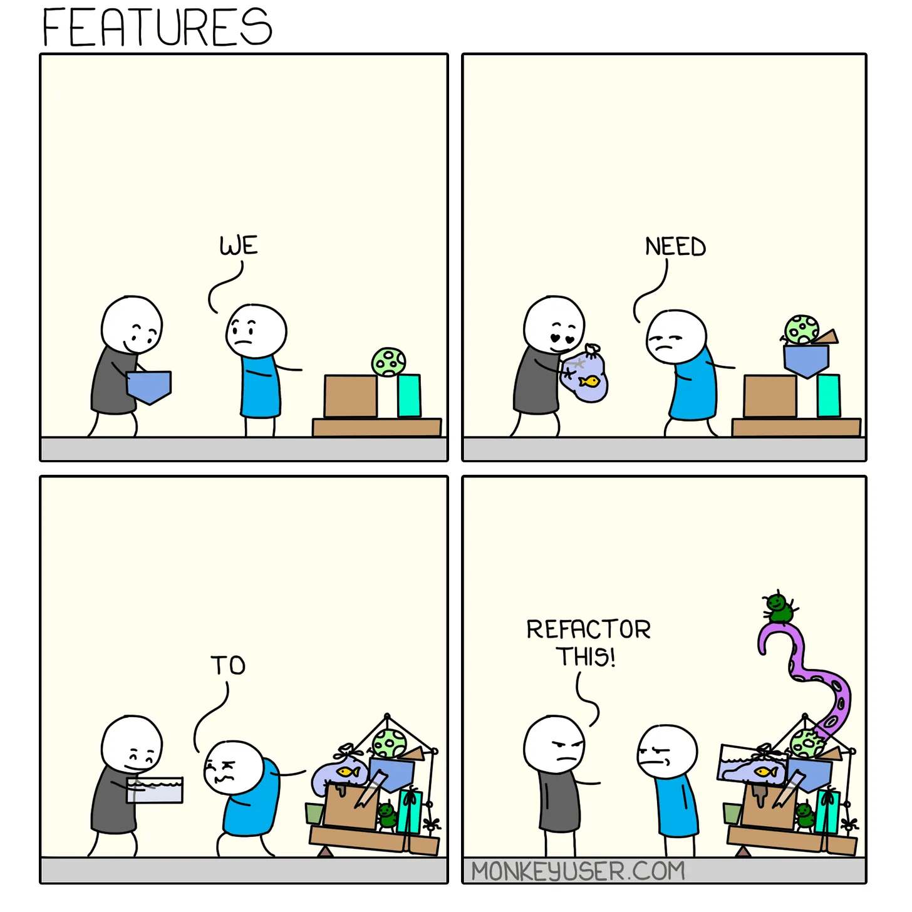

# Architecting for Simplicity

## Architecture

Architecture is the foundation of a system and provides rules for consistency, maintainability, and scalability. Features are built on top of the architecture and a flexible architecture allows for easier evolution and extension over time as new features are added.

“There are two ways of constructing a software design: One way is to make it so simple that there are obviously no deficiencies, and the other way is to make it so complicated that there are no obvious deficiencies. The first method is far more difficult.” - Tony Hoare

Designing a complicated architecture is a relatively simple task as we can add complexity to solve any problems that arise in the system. However, creating a simple architecture without any visible flaws is quite challenging, as we must strike a balance between functionality and complexity.

In order to achieve a simple architecture, it is crucial to have a clear understanding of the problem at hand and establish well-defined boundaries for the architecture. If there are no boundaries, the problem may become exceedingly complex. A simple architecture can reduce the amount of communication required between different engineers, making it easier to maintain, support, and modify. Simplicity also means focusing only on known requirements and avoiding over-prediction of future needs.

## Simplicity is Reliability

“Simplicity is a prerequisite for reliability”, said Edsger W. Dijkstra. I agree with that. A complicated architecture can lead to confusion and uncertainty for software engineers, making it difficult to understand what is happening in the system and being afraid of changing the architecture. This can ultimately lead to lower reliability because engineers may not know how to solve issues when they arise. Furthermore, unknown unknowns can demotivate engineers and lead to a cycle of suffering. On the other hand, a simple architecture is easier to understand, maintain, and extend, which can lead to greater reliability. With a clear understanding of how the system works, engineers can quickly identify and resolve issues, improving overall reliability.

## What Leads to Complicated Architecture?

### Unclear Requirement

Ambiguous or inaccurate requirements can lead to complicated architecture. Product managers play a crucial role in the Requirements Gathering Process as they are responsible for defining and documenting the system's requirements. If they don't have a clear understanding of the system's responsibilities or they try to imagine user needs, it can lead to a lack of clarity in the requirements.

This ambiguity can then lead to a complicated architecture, as developers may have to make assumptions or fill in gaps to try and understand what is required. This can result in a design that is overly complex, hard to maintain, and difficult to extend.

### Over-engineering

Software engineers have a passion for tackling challenges using advanced technologies. When it comes to solving problems in software engineering, there is no one-size-fits-all solution. Often, we have multiple options at our disposal, and we must weigh the pros and cons of different design choices. Some engineers strive for perfection and aim to create an architecture that can handle all scenarios, but this is impractical since every design choice involves trade-offs. Eventually, it leads to a complicated architecture that is hard to maintain and understand.

### Unclear Service Responsibility 

Ambiguity in service responsibility can lead to complex architecture because software engineers may end up adding different logic to the service without a clear definition of its boundary and responsibility. This can happen because most software engineers prioritize making things work rather than considering maintainability. As a result, the service can become convoluted, with too many functionalities and a lack of clarity on what each part of the service is responsible for. This can cause confusion and difficulties in maintenance and future updates. It's important to have a clear understanding of service responsibility to ensure a well-designed and maintainable architecture.

## How to Achieve Architectural Simplicity?

### Demand Clarification

Clarifying demands is an important process before designing architecture. It decides how much your team should invest in the whole development process. Therefore, ask questions to clarify business needs! Sometimes, not every line of requirements is needed. So, asking the right questions can definitely help you pull out the demands that are not necessary for the architecture.

In general, there are 2 types of demands:

- **Forecast Demand** - It is a prediction of what users may want or need in the future. Usually, it expresses “I want” instead of “User wants”. It is often based on an assumption about what might be useful or desirable.

- **Actual Demand** - It is based on real user needs and preferences that are gathered from research, analytics, and feedback. This type of demand reflects what users actually want or need in the system and it should be the primary focus during architecture design.

By focusing on the actual demands, we can ensure the architecture meets the current needs of the system while also leaving some room for future extensions and changes that may be required to meet the forecast demand. It's important to strike a balance between meeting current needs and preparing for future requirements to avoid creating an architecture that is either too rigid or too complex. This can make sure we don’t invest too much in the prediction.

### Complexity Analysis

Once requirements are confirmed, we can design an architecture to support user needs. We might need to deal with 2 types of complexities that are derived from technical.

- **Accidental Complexity** - It is not inherited from the original problem. It is introduced into the system unnecessarily. This complexity can arise due to various reasons such as over-engineering, premature optimization, or lack of experience.

- **Essential Complexity** - It is inherited from the original problem. It is the essence of the problem that you need to resolve. This complexity can arise from the problem domain, the business requirements, and the necessary interactions with other systems or components.

In general, the goal of architecture design is to manage the essential complexity while minimizing accidental complexity. By doing this, we can simplify the architecture and focus on the original problem instead of dealing with additional technical complexity that is not necessary for the architecture. To achieve this goal, we need to understand the problem well and choose the right technology to solve the right problem. This can ensure we are not wasting our efforts in the wrong direction. Therefore, understanding the trade-off of different design decisions is important.

### Separation of Concerns

Creating good architecture involves considering the separation of concerns, which helps to define clear responsibilities and reduce coupling. Most technical complexity comes from unclear service responsibility and greed. When you want to delight other teams and deliver more value in the service, you will start customization and cause the architecture hard to maintain. For example, when faced with a requirement for a push notification service to allow delayed job submissions for push notifications to be sent after a certain time period, how would you design it?

While both putting the delayed job logic in the push notification service or upstream services can achieve the goal, putting the delayed job logic in the push notification service can lead to ambiguity and confusion in the architecture. The responsibility of the push notification service should be solely to send push notifications, not to assist upstream services with task scheduling.

The separation of concerns allows for loose coupling, which is a vital principle in good architectural design. Rather than having the scheduling logic tied to the push notification service, each service should have its own scheduling logic built on top of the capability provided by the push notification service. This approach decouples the scheduling logic from the push notification service, making the architecture simpler and easier to maintain.

### Visualization

Visualization is key in architectural design, it helps to ensure that the knowledge and understanding of the architecture are shared among team members and stakeholders, reducing the risk of confusion and misunderstandings. Therefore, architecture visualization is important to align the ideas between different engineers. With architecture diagrams, the ideas are visualized and it creates opportunities for engineers to review the architecture and remove unnecessary components.

### Continuous Evaluation

Architecture is not a one-time thing; it is an ongoing process. As the system evolves and new features are added, it is possible that the system might deviate from the original design. If changes are made without considering the existing architecture, it can lead to a divergence from the original design and potentially introduce technical debt and other issues, as architecture is a set of rules to make the software work within a reasonable scope. When the scope of the system grows beyond the current architecture's capabilities, it may be necessary to introduce a new architecture that can handle the increased complexity and demands. Therefore, it's important to continuously evaluate the architecture and make necessary changes or even completely re-designed it to ensure it remains scalable, flexible, and maintainable.

## Conclusion

To establish a strong foundation for extending features and maintaining the system, we prioritize achieving architectural simplicity. This approach guarantees that the team understands the system's architecture, enabling them to handle any arising issues and preventing the need to deal with unknowns.

Moreover, simplifying the architecture allows us to easily integrate new requirements and expand the system's capabilities without resolving any unknowns or seeking input from other engineers to comprehend the current architecture. By prioritizing architectural simplicity, we also promote increased engineering efficiency and architecture reliability.

 

<link href="https://fonts.googleapis.com/css?family=Cookie" rel="stylesheet"><a class="bmc-button" target="_blank" href="https://www.buymeacoffee.com/raychongtk">Buy me a coffee</a>

