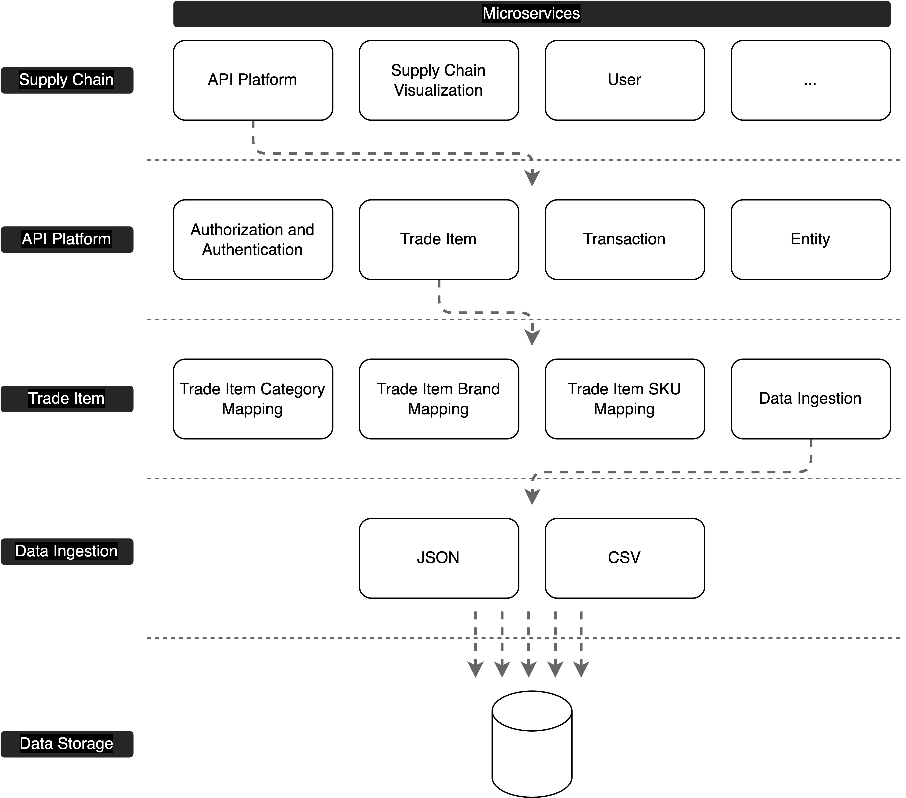

# Architecture Mystery
Working as a software engineer, you might always hear people talking the word “architecture”. But, what is architecture? I think the first word that comes into your mind is microservices architecture.

Of course, microservice is an architectural pattern. But it is too vague. When talking about architecture, usually, we can refer to different granularities and layers, roughly including:

- System
- Subsystem
- Module
- Function

With these layers in mind, we can describe architecture from different angles. The example below explains the architecture of a supply chain system in different granularities.

## System
System level architecture describes the system as a whole. At this level, we can see all subsystems are listed and their dependencies. For example, a supply chain system might have an API Platform, Supply Chain Visualization, User, Transaction, Trade Item, and so on. All these subsystems together form the supply chain system.

## Subsystem
Subsystem level architecture describes the subsystem capabilities and what modules the system provided. As you can see, System and subsystem levels are quite similar. The difference between them is the granularity.

## Module
Module level describes the actual functionalities that the subsystem provided.

## Function
Function level describes the actual code implementation for the functions.
