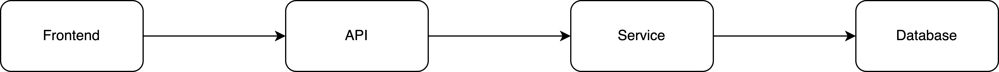
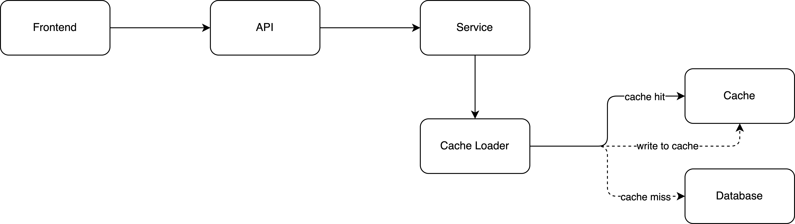

# Boose API Read Performance by 10x with Cache
Today, we are going to discuss applying a cache strategy to the API in order to boost the API read performance.

In a normal retrieval API call, we have 4 stages frontend, API, service, and eventually reach the database. This is how it looks:

The system might have a bottleneck on the database layer if the traffic is large. Under this architecture, all traffics hit the database directly and it can cause resource contention issues, especially if there are a large number of concurrent requests accessing the database.

To address this issue, we can consider using a caching technique — Cache-aside Pattern. It is a popular cache strategy in software engineering. The app always read data from the cache first and then reads from the database if the cache is missed and writes back to the cache.

By introducing a new architecture that includes caching, an application can benefit from faster data access because the cache is built on top of memory storage.

Memory storage is much faster than disk storage, which is typically used for storing data in a database. When data is stored in memory, it can be accessed and retrieved much faster than if it were stored on a disk.

By using caching, an API can improve its performance by reducing the response time for frequently accessed data. This can lead to a better user experience and can also help reduce the load on the database.

To use Cache-aside Pattern, we should consider:

- **Percentage of Read & Write** - Consider the percentage of read and write operations in the API. If the API has a higher percentage of reads, caching can be more effective in improving performance. If the API has a higher percentage of writes, caching may require additional considerations for maintaining consistency between the cache and the database.

- **Total Traffic** - Consider the total traffic to the API and the database. Caching can help reduce the load on the database, but if the traffic is too low, you may not need a cache, as it will increase the architecture complexity.

- **Consistency** - Maintaining consistency between the cache and the database is important to ensure that the data being used by the API is accurate and up-to-date. If the API needs high consistency, you might need to think deeper about the trade-off of applying a cache strategy to the API.

- **Data Characteristic** - Consider the data traffic and characteristic. It may not be effective if the traffic to a particular data is too high. You may need to implement additional scaling strategies, such as sharding or load balancing to handle the hot data.

In conclusion, when implementing the cache-aside pattern, you should consider the percentage of read and write operations in the API, the total traffic to the API and database, and consistency between the cache and the data source. These factors will help you create a better caching strategy for improved performance, reduced load on the database, and data consistency.

 

<link href="https://fonts.googleapis.com/css?family=Cookie" rel="stylesheet"><a class="bmc-button" target="_blank" href="https://www.buymeacoffee.com/raychongtk">Buy me a coffee</a>

