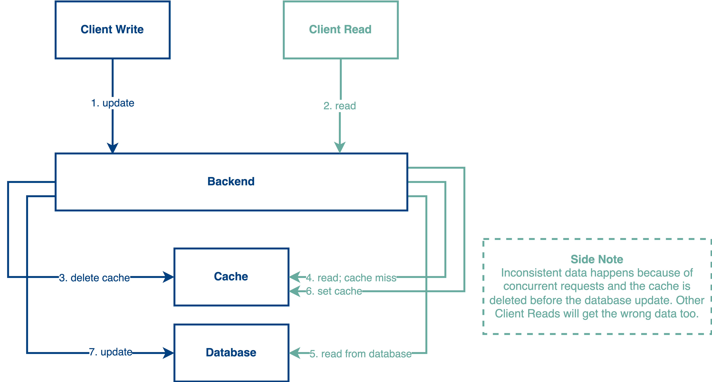
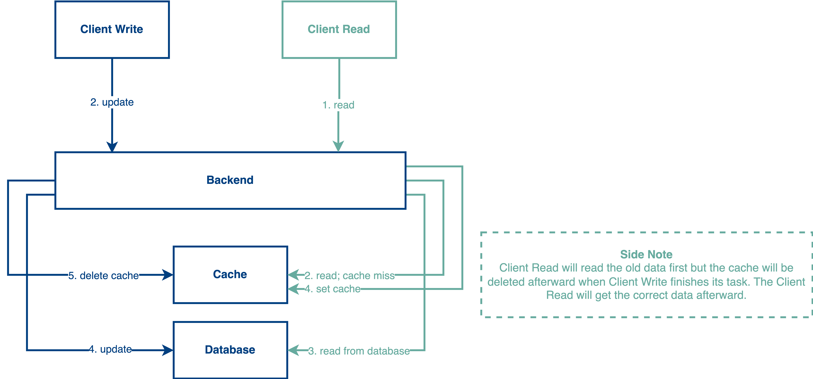

# Cache Delete Strategy of Cache-aside Pattern
In the cache patterns post, I asked a question:
>Do you know why we don’t remove the cache key first and write to the database afterward?

Here is the reason why we don’t do this.

## ❌ Delete the cache before updating the database:

According to the diagram above, it is obviously a dirty read that happened in steps 4 to 6. As you can see, we perform step 3 to delete the cache and now a Read request comes and found that the cache is missing. So, it performs an action to read the data from the database and set the data back to the cache.

Since the Write request is not finished yet and the Read request runs faster than the Write request so a data inconsistency problem happens in the cache. The subsequent requests will be reading the staled data from the cache since there is no action to remove the cache until the next Write.

To mitigate the data inconsistency problem, we can update the workflow to the following sequence.

## ✅ Delete the cache after updating the database:

Now, the workflow is updated. As you can see in the diagram above, we perform a database update first and clear the cache afterward. 

Under this flow, the Write request can delete the cache even if the Read request set the stale data into the cache. The subsequent requests will be reading the correct data from the cache. But, there is still a problem in steps 2 to 5 which is related to the execution sequence. 

If step 5 runs faster than step 4 (set cache), it will cause the data inconsistency problem again. But, it is less chance to have this problem in most of the use cases.

Also, when adopting a cache strategy, we always need to have a reasonable expiry time to deal with the data inconsistency problem. We are not designing a strongly consistent system, so a little bit of data inconsistency is acceptable in most of the use cases.