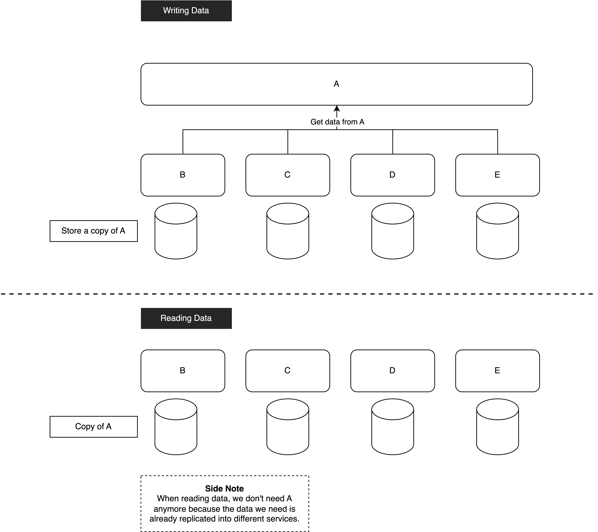

# Consistency and Availability
When talking about Consistency and Availability, data replication is one of the topics that we can discuss.

Data replication is one of the ways to increase availability. The more you replicate, the higher availability. Conversely, the more you replicate, the less consistent. 

In most systems, we prefer availability over consistency. If the system is not available, then no matter how consistent it is, people will not use it. Instead, if the system is highly available with a good user experience, even if we sacrifice a little bit of data consistency, people will still love it.

To further discuss this topic, let’s take the following scenario as an example. Imagine we are working on a heavy-read system. Now, A service is the data provider for B, C, D, and E services.

## Embrace Consistency

In a consistency system, every time when we read A service’s data in B, C, D, and E services, they need to invoke A service to get the necessary data.

> What if now A service is down? We can’t read the necessary data anymore and B, C, D, and E services are all gone too.

If we change the design a little bit, the output will be totally different.

## Embrace Availability

In this design, we get the necessary data from A service first when writing data for B, C, D, and E services. 

Now, moving to read data scenario. Since we already have a copy of A’s data, B, C, D, and E services do not need to invoke A service to get the data anymore.

> What if A service is down? It will only affect the writing data scenario but the reading data scenario will still be functioning. In a heavy-read system, this design helps a lot. When reading data, we don’t need to depend on the data provider. Also, A service does not have to handle the read traffic from B, C, D, and E services.

### What’s the trade-off for this design?

- More storage is needed for the data copy
- Data inconsistent when the data in A service is updated

Compared to the impact that the first design bring to us, the trade-off of the second design seems reasonable and we can tolerate it in most scenarios.