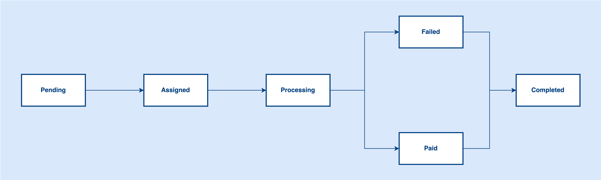
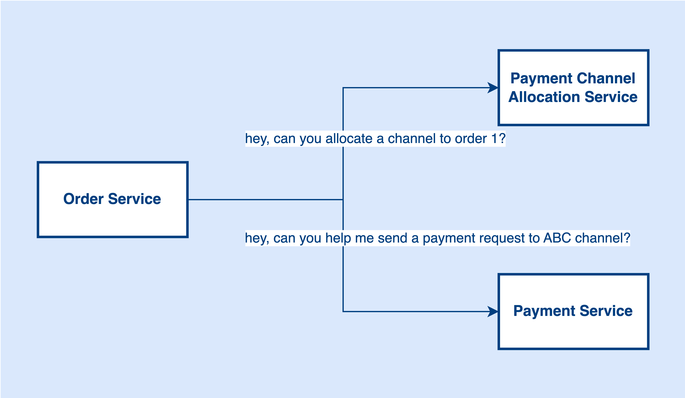

# Payment Event-driven Architecture
Event Driven Design is a popular architectural style and has many benefits if you are building a complex system, especially building a state transitions workflow.

Let’s take the payment order workflow as an example. An order has many states like Pending, Assigned, Processing, Failed, Paid, and Completed. When the order is placed in the system, it will be Pending. After that, the order will be Assigned to one of the payment channels. The status will become Processing when the payment request sends to a third-party gateway. It will be either Failed or successfully Paid when the third-party gateway returns the result to us. Finally, we need to send a callback to our client to complete the order, it will be Completed at this stage.

With the requirements above, we can break down the problem into different parts.

1. Handling order creation
2. Assigning payment channel to new orders
3. Sending payment requests to third-party vendors
4. Updating order status and making sure the status sequence
5. Sending callbacks to clients

Okay, so how do we utilize Event Driven Design to help us archive the above goals?

Before talking about Event Driven Design, let's think about the request-response pattern first. Probably it will be something like the one below. Let Order Service orchestrate the order workflow and use direct HTTP calls to invoke other services. (Or Order Service invokes Payment Service, and Payment Service invokes Payment Channel Allocation Service.)

When the payment provider callback the Payment Service, it needs to invoke Order Service to update the status.

What are the problems in this architecture? Think about it. Leave your thoughts in the comment section.

With the event-driven design, the architecture might look like the below diagram:

Introduce different event topics in the architecture, like order-created for notifying other subscribers that a new order is available in the system. Once subscribers receive a new order created event from the topic, they can do their own job accordingly. For example, the Payment Gateway Allocation Service might need to allocate a payment channel to a new order. 

After that, the Payment Gateway Allocation Service might further publish another event payment-channel-allocated to tell its subscribers that a new order with an allocated payment channel is now available to consume. The Payment Service will then fetch the allocated order from the topic and consume it.

When Payment Service sends the order to third-party providers, it will publish an order-updated event to tell subscribers a payment order is updated.

In this workflow, the Order Service does not need to talk to the Payment Gateway Allocation Service directly and the Payment Gateway Allocation Service does not need to talk to the Payment Service too. Instead, they communicate with each order through events.

In this architecture, when a new payment order is submitted to the system, it is like telling everyone there is a new event about order creation, if you care about order creation, please do your own handling. That said, the upstream services do not need to care about how the downstream service handles the logic after order creation.

What are the benefits of using this architecture?

- Decouple service dependency
- Better availability and scalability

> Can you tell me any drawbacks of event-driven design? Leave comments below to share your thoughts.