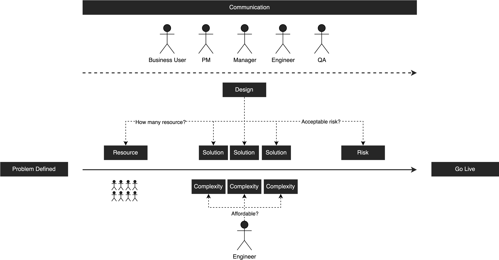

# Exploring Architetcure: What Does It Really Mean?
I have been delving into architecture across many discussions. But what exactly does architecture mean? While many might perceive architecture as the utilization of technologies to address engineering challenges – which is indeed one of its core objectives – it includes more than just that. It serves as a guiding framework at various project stages, beyond engineering hurdles.

The underlying purpose of architecture extends to the identification of intricacies, risk assessment, communication, and the strategic allocation and integration of resources.

## Integration and Allocation of Resources

A pivotal consideration in architectural decisions is an awareness of existing engineering resources. Resource availability determines whether the team possesses sufficient engineering capacities to facilitate a timely feature rollout, thereby impacting time-to-market. During the architectural phase, it becomes imperative to measure the necessary engineering resources required and assess their value proposition. Given the precious nature of engineering resources, strategic investment in the right areas is crucial to enhance product value. If a feature holds substantial significance, a proportional augmentation of resources can be allocated. This necessitates the seamless integration and judicious allocation of all available resources.

## Management of Risk

Once the resource allocation is outlined, risk evaluation becomes paramount. The architecture design phase mandates a comprehensive assessment of potential risks, necessitating trade-offs and decisions to be made. The acceptability of these risks upon deployment becomes a vital consideration. By effectively mitigating explicit and critical risks, it becomes feasible to control the impact of challenges that may exceed the architecture's capabilities.

## Control of Complexity

A fundamental facet of architecture pertains to complexity management. Each design inherently carries a level of complexity, but not all levels are tenable for a given team. During the architectural blueprinting, it becomes imperative to account for the team's proficiency and resource availability. This strategic consideration aids in maintaining a complexity threshold that aligns with the team's capabilities, fostering a sustainable architecture. Architecture is not a universal solution but varies depending on the situation. To create an effective solution, we should eliminate unnecessary complexity and create a design to address the specific problem we intend to solve.

## Communication and Collaboration

Architecture acts as a communication tool connecting team members, stakeholders, and various technical and non-technical groups engaged in the project. A clearly outlined design document plays a crucial role in ensuring that everyone comprehends the project's framework and objectives.

## Conclusion
In a nutshell, architecture's purpose extends beyond engineering challenges. It aids in resource optimization, risk mitigation, complexity control, and effective communication, making it a pivotal factor in successful project development.

 

<link href="https://fonts.googleapis.com/css?family=Cookie" rel="stylesheet"><a class="bmc-button" target="_blank" href="https://www.buymeacoffee.com/raychongtk">Buy me a coffee</a>

