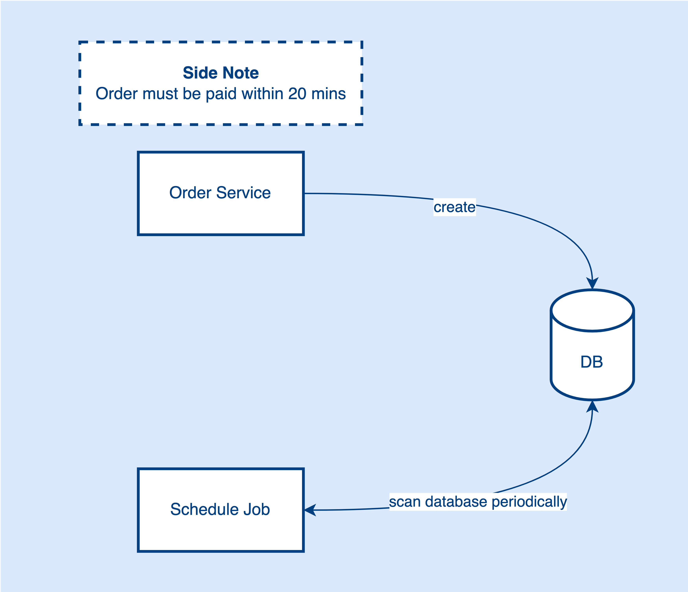
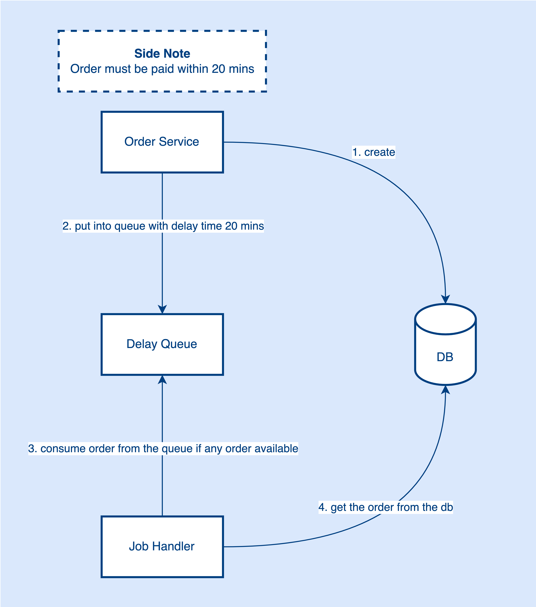

# Handling Jobs Efficiently
Today, I’ll be covering a topic about background tasks in software development. It is so common that software engineers need to write code to trigger something automatically in different time intervals.

Working in a backend system, you might need to deal with these scenarios:

- Cancel the order if payment is overdue
- Retry with delay
- Cancel application submission if supporting documents haven’t upload
- …

Imagine if you are working on an eCommerce system, customers are able to place orders in the system and make the payment. Also, the payment must be made within 20 mins the order being created or else cancel the order.

How will you handle this requirement? Let’s think about it.

I guess the first thing that comes to your mind is the Scheduled Job. Using scheduled jobs, the app can run a task periodically in the background.

## Scheduled Job

When the order is placed in the database, a scheduled job will be in and scan the database periodically say every few seconds or more. If there is any order that matches the criteria (creation time after 20 mins and unpaid records), the scheduled job will cancel those orders.

Everything looks good by using this approach. It solves the problem that describes in the requirement. But, let’s think deeper.

How do we define the frequency of the job? It’s hard. We can’t make the interval too frequent or too long.

What if the data size is large? Probably will be very slow.

What will be happened if we scan this large dataset frequently? Probably adds a lot of pressure to the database.

What if there is no new order being made and we still keep scanning the table? Probably we are wasting resources.

To mitigate this problem, Delay Queue comes into play. We can introduce a delay queue to the system to solve the problems mentioned above.

## Delay Queue

With a delay queue, we can put the created order into the queue with 20 mins delay time. A job handler will be listening to the queue to see if any order is available to consume. If now the order has been created for 20 mins, the job handler will get this order from the queue and search the order status in the database.

There are 2 possible cases here:

- Payment is already made, then ignore the order canceling flow.
- Payment hasn’t been made, then run the order canceling flow.

Now, we don’t need to scan the database frequently, especially in the zero new orders scenario. Also, we can get the order by primary key. Using the delay queue helps mitigate the pressure on the database.

Possible delay queue solutions:

- [Redis](https://redis.com/glossary/redis-queue/)
- [RabbitMQ](https://blog.rabbitmq.com/posts/2015/04/scheduling-messages-with-rabbitmq)
- [AWS SQS](https://docs.aws.amazon.com/AWSSimpleQueueService/latest/SQSDeveloperGuide/sqs-delay-queues.html)

To sum up, for small-scale systems, the scheduled job is definitely a good and simple solution. But, when the data and traffic get more and more, the delay queue will be more suitable to solve the problem.

 

<link href="https://fonts.googleapis.com/css?family=Cookie" rel="stylesheet"><a class="bmc-button" target="_blank" href="https://www.buymeacoffee.com/raychongtk">Buy me a coffee</a>

