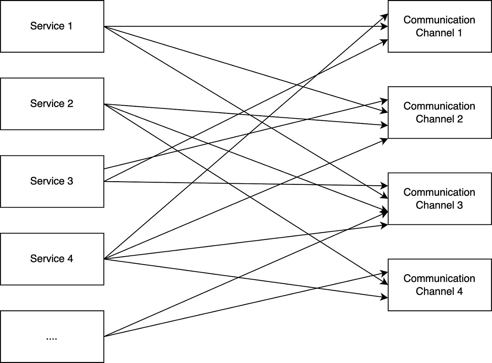
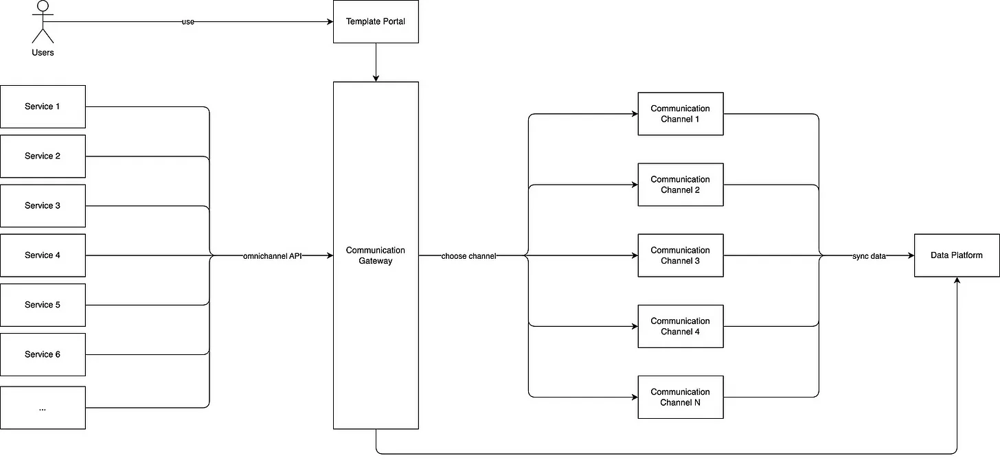
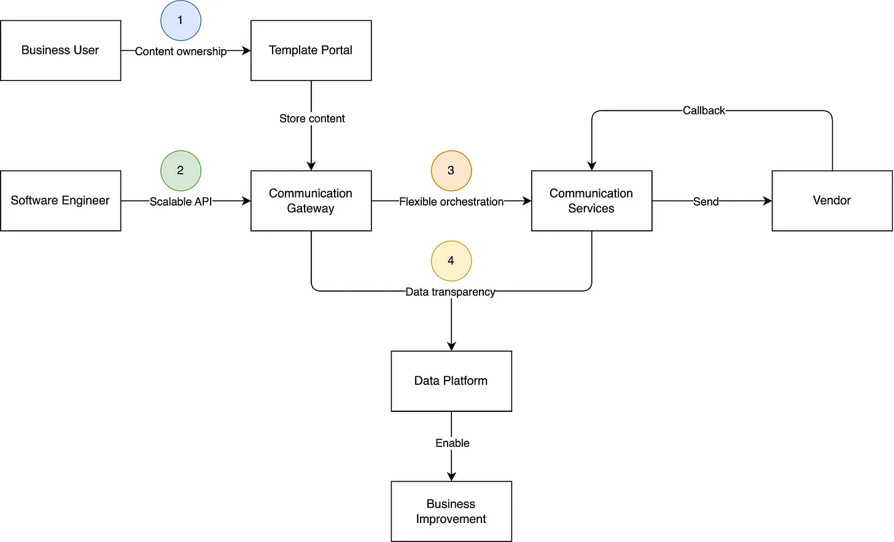
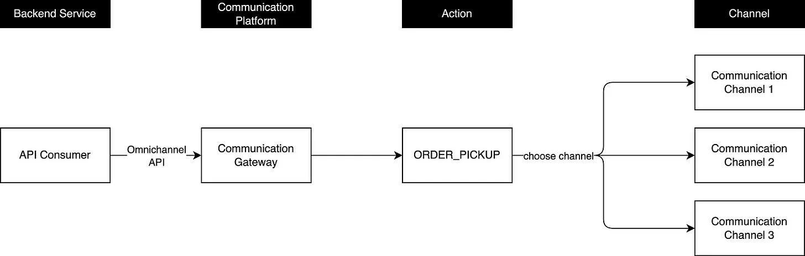
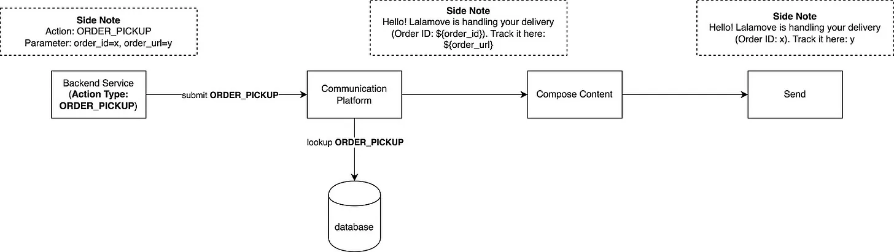

# How Does Lalamove Scale Its Communication Platform?

## Introduction
The communication platform acts as an important role in the Lalamove ecosystem in communicating with Lalamove’s users through various communication channels. Lalamove sends out hundreds of millions of communication monthly to communicate with Lalamove’s users through various communication channels such as SMS, Email, and Push. Our goal is to provide a scalable, state-of-the-art, and cost-effective omnichannel communication platform to boost engineering and operational efficiency for our internal teams.

However, we have identified several challenges from both business and engineering viewpoints within our current communication platform. To gain a better understanding of these challenges, it is necessary to examine our legacy architecture.

## Challenge

Under this architecture, each feature team directly connected their services to the communication services, creating scalability challenges and various difficulties for Lalamove’s engineering team.

The following are the challenges we faced with this architecture:

- **Difficult to integrate with multiple communication services** - Feature teams have to integrate with multiple communication channels independently when sending communication. For instance, if there are five communication channels, the feature teams have to integrate with the communication platform five times, which requires significant integration and communication effort and adversely impacts engineering efficiency.

- **Lack of communication orchestration** - The legacy architecture is a multi-channel solution but lacks omnichannel capability. This makes the communication platform not flexible enough for feature teams.

- **Redundant development effort** - Currently, the development effort for common communication features is huge under this architecture such as data visibility and template management. We need to develop the same feature in multiple communication channels independently. This hurts engineering efficiency and maintainability.

To improve Lalamove’s communication capability, we developed a communication gateway. In the following discussion, we will introduce the new architecture of the communication platform and highlight the various capabilities that the communication gateway brings to our internal users.

## Communication Platform Architecture

The communication gateway is a critical component of the communication platform, allowing feature teams to integrate once and enjoy seamless updates.

In this architecture, we aim to provide the following capabilities:

- Provide scalable APIs and communication orchestration to enable omnichannel communication
- Encapsulate communication logic to avoid duplicated effort
- Define clear responsibilities for different stakeholders by separation of concerns
- Enable business improvement through data transparency

By rearchitecting the communication platform, we redefined the core values of the communication platform. It is important to understand our project’s core values, as it defines the vision of the communication platform and reflects our philosophy.

## Core Value

The next-generation communication platform is built to provide four key capabilities: Ownership, Scalability, Flexibility, and Transparency, together they form the core values of the communication platform and enable the communication platform to provide a complete solution for internal users.

### Clear Ownership

Clear ownership is provided in the communication platform, where each template is assigned to a specific team. This enables us to easily identify the responsible team and the triggering service in case of any production issues. Separation of concerns is also prioritized in Lalamove’s communication ecosystem, with the business team owning the communication content rather than the tech team.

### Scalability

We simplify integration with the communication platform by offering an omnichannel API. The communication gateway abstracts the communication process, making it easy for users to leverage its benefits. By integrating with the communication platform once, users can enjoy seamless updates.

### Flexibility

To effectively manage communication under various conditions such as channel switching and content management, we need a flexible approach. The communication platform offers just that, allowing our business teams to update channels and content without needing our engineers to make any code changes or perform deployments. This not only simplifies the management of communication channels but also enables our platform to be more flexible.

### Transparency

Our goal with the next-generation communication platform is to provide our internal users with data transparency by allowing them to see the effectiveness of our communication efforts. To achieve this, we have a data pipeline to ingest the data and provide data transparency to our internal users.

Then, how do we rearchitect the communication platform to solve the challenges that we had and achieve our core values?

## Omnichannel

With the omnichannel API, the communication gateway is able to orchestrate communication in different communication channels according to different business strategies. Also, we provide a single entry point for our users to allow them to integrate with the communication platform once and enjoy seamless updates.

In this design, we have a concept called “Action” and it is used to define communication. An “Action” usually refers to a business scenario. Each “Action” maps to one or many communication channels. By using this concept, we can scale our communication easier without coupling communication to a specific communication channel.

This brings flexibility and reliability to the communication platform and convenience to the users. The users can switch the channels anytime without code changes and get rid of integrating the communication platform repeatedly.

## Communication Encapsulation

Communication encapsulation is important, as it helps to centralize communication handling logic. One of the principles we adopted in the communication platform is the Separation of Concerns.

To understand it, we can take the content composition as an example. The content and channel are managed by the communication platform instead of our consumers.

That being said, users can register a template in the communication platform and send a communication request by providing the necessary parameters. After that, all the content composition logic will be done by the communication platform. This separates the concerns of different stakeholders and makes communication logic more cohesive.

## Template Portal

The template portal serves as a user interface that enables internal users to manage communication templates and channels in a self-service manner, without relying on the tech team to change backend code. With the separation of concerns, we streamline the process of managing communication template translations and provide autonomy to internal users.

## Key Takeaway

There are a few key takeaways from our re-architecture journey, including

- **Content Management Workflow** - Content management was a critical challenge at Lalamove as the content was spread across various services, making it difficult to scale and define maintenance responsibility. To address this challenge, we aligned our core values and defined that the content should be managed by business users rather than software engineers. To achieve this, we developed a portal that empowers business users to manage template content and have communication autonomy.

- **Communication Orchestration** - Communication orchestration is a critical aspect of any communication platform, as it determines whether the platform can be easily scaled or not. At Lalamove, we faced the challenge of having multiple communication channels but lacking omnichannel capability. Through our experience, we have come to understand the importance of having a communication platform that is equipped with omnichannel capability, as it can provide the necessary flexibility and reliability to ensure seamless communication across all channels.

- **Importance of Microservice Orchestration** - The orchestrator service, Communication Gateway, in our new architecture encapsulates and centralizes common communication logic, which eliminates the need for multiple entry points and reduces the complexity of the communication platform. Communication services can now focus solely on communication, while the communication gateway handles communication orchestration, such as request management, channel selection, and content composition. This design not only improves engineering efficiency but also allows for easier maintenance and scalability of the communication platform.

## Conclusion

In the legacy architecture, there were independent components with no connection between them, leading to challenges.

With this in mind, we spent so much effort thinking about how to connect different components together and build a scalable, state-of-the-art, and cost-effective omnichannel communication platform. It offers numerous benefits such as template and channel management, scalable APIs, and communication orchestration.

The communication platform is designed to provide 4 key capabilities including Ownership, Scalability, Flexibility, and Transparency, and they combine to establish the Communication Platform’s core values. This help improves the developer experience and boosts engineering and operational efficiency at Lalamove.