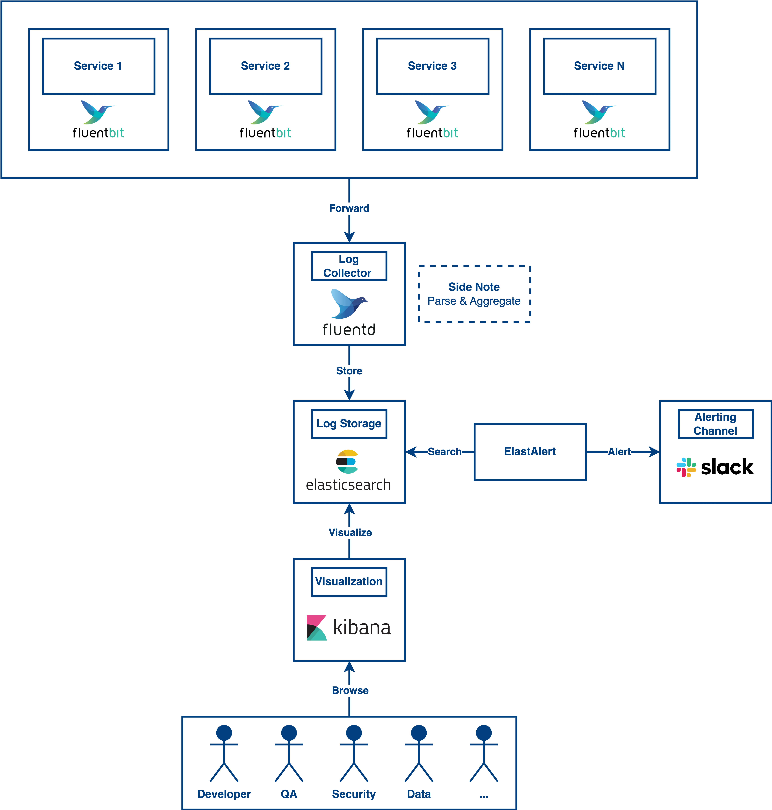

# Log Monitoring and Alerting
In this post, we are going to talk about log monitoring and alerting. It is also an important component of a system. Without this, your software engineers do not know what is happening in the whole system. That said, when an error occurs, no one knows and the engineering team does not know whether the system performs well or not. After reading this post, I expect you will know how a log monitoring system works.

Here we are going to have a high-level understanding of a log monitoring system. There are many solutions for log monitoring and alerting like New Relic, Datadog, etc. In this post, I am gonna give you an idea for log monitoring and alerting on leveraging elastic stack.

## Collect and Process Logs
For collecting logs from containers, we can use the fluent bit to read the container logs directly and forward the logs to the fluentd. After that, the fluentd will parse and aggregate the logs according to your rules and then push the logs to the elasticsearch for storage.

## Send Alerts
After storing the logs, we want to leverage the logs for alerting if any error occurs by using ElastAlert. It will search the logs on the elasticsearch according to the rules that you defined. If any record hits the condition, ElastAlert will push the notification to Slack(or other channels) to notify your engineering team or business team.

## Query Logs
Kibana is introduced in this design to solve the logs visualization and query issue. Your team can browse the logs from Kibana UI and filter the results by whatever condition you want.

## Monitoring Dashboards
Kibana is a great tool for you to create some metrics based on your logs. It enables your team to create graphs, aggregated data, tables, etc. You can create the dashboards based on your business need including system performance, daily error rate, traffic, and so on.

## Conclusion
In conclusion, a log monitoring system at least needs to have alerts, dashboards, and good query functions. Also, your logging system needs to be scalable to support a huge amount of log entries. For this, Fluentd and Elastic Stack both provide good scalability for users to scale the instances.

 

<link href="https://fonts.googleapis.com/css?family=Cookie" rel="stylesheet"><a class="bmc-button" target="_blank" href="https://www.buymeacoffee.com/raychongtk">Buy me a coffee</a>

