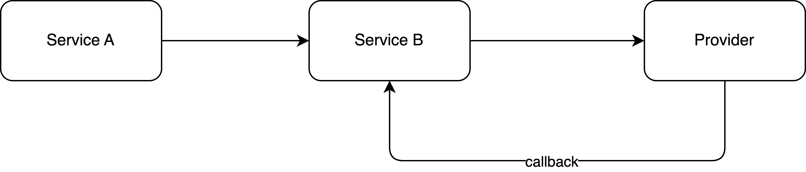
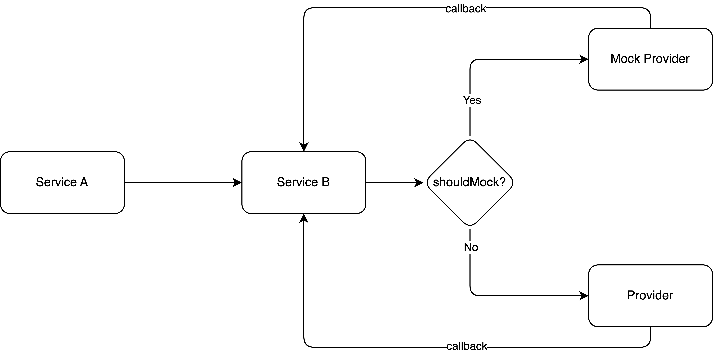

# Redeisn Your Development Workflow with Mock Service
Today, I will be sharing the idea of a Mock Service in the software development workflow.

It is common that a system to integrate with third-party providers such as payment and communication providers. In normal architecture, a service connects to a provider directly in different environments.

## What are the problems in this architecture?

- **Unable to test the error use cases from providers** - Your app cannot test unexpected responses under this architecture because you do not have the right to control the third-party provider.

- **Unable to have end-to-end automated tests** - Your app does not have the capability to test different behaviors with a real provider.

To tackle the listed problems, a mock provider is introduced into the architecture.

This approach allows developers to test and verify the app's behavior in a controlled environment before deploying it to the production environment. The mock provider is designed to respond to requests in the same way as a real provider would, allowing developers to test error cases and edge cases that might not occur during normal operation. By simulating different scenarios, developers can ensure that the app behaves as expected under different conditions, reducing the risk of bugs and issues in production.

## What benefits does this architecture bring to you?

- **Empower developers to test different behaviors** - With a mock provider, we can create our own test assets to mock different behaviors, and that enables developers or QA to run a complete test for different scenarios before rolling out.

- **Enable end-to-end automated tests** - A mock provider can facilitate end-to-end automated tests to ensure the latest code does not break the existing behaviors. We can control the percentage of success or failure rate to cover different scenarios. With end-to-end tests, we can promote refactoring culture in the team and help developers build confidence in shipping code. Also, if there is anything broken, we can send an alert to notify developers.

- **Simulate Chaos** - With the mock service, we can randomly inject chaos into the mock provider to verify whether our services can handle the chaos properly.

## Conclusion
To sum up, integrating with third-party providers in a system is common and it might have different problems during the integration such as hard to simulate unexpected behaviors. By introducing a mock provider to the system architecture, developers can verify the API behaviors in a controlled environment, test different scenarios and error cases, and reduce the dependencies on third-party providers. With that, developers and QA can test whatever they want by simulating the behaviors of a real provider.