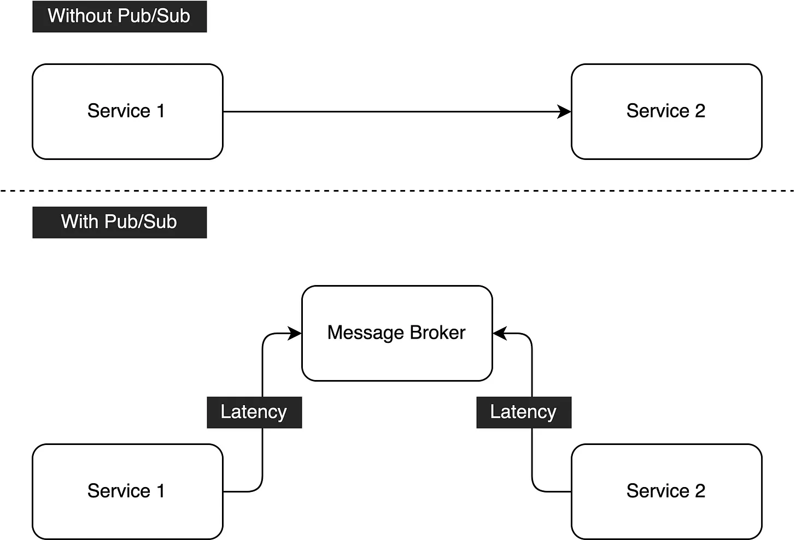
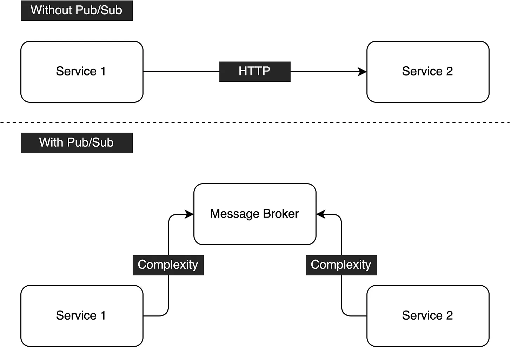
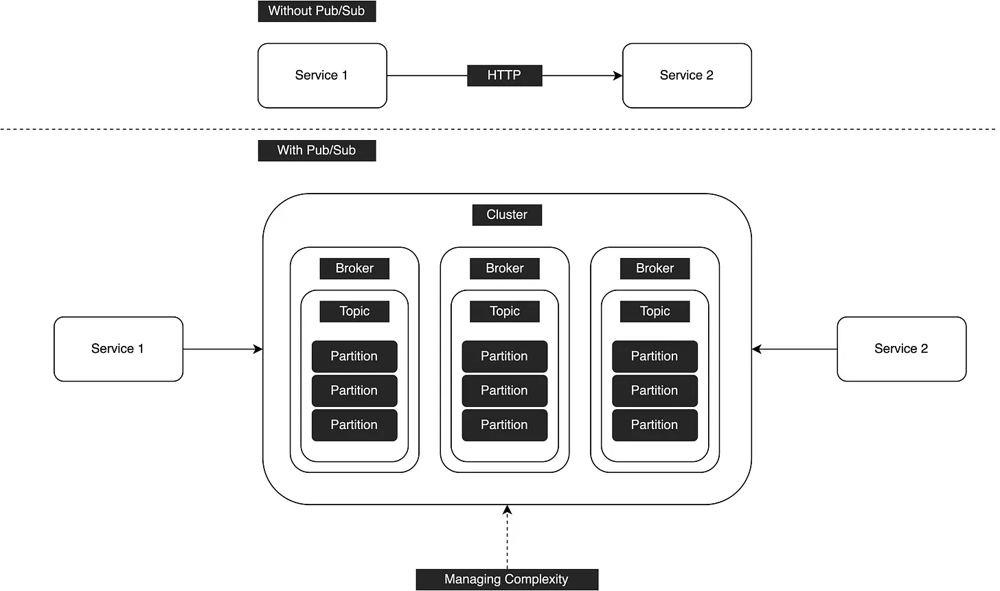

# Pub/Sub Practical Guide: Trade-off
Pub/Sub makes an architecture to be resilient to failures and increases system availability in a high-traffic situation. But, it also brings us several drawbacks. In this article, I will walk you through the potential drawbacks of Pub/Sub architecture.

Applying Pub/Sub architecture to a system might have the following trade-offs:

## Latency

Introducing a Pub/Sub to a system will increase latency. The diagram shows the difference between direct connection and indirect connection. Originally, Service 1 only communicate with Service 2 directly through REST or RPC. After applying Pub/Sub, the request is submitted to Message Broker first, and then wait for Service 2 to consume the messages. This introduces latency to the system and it will be obvious when traffic is high.

## Development Complexity

Before applying Pub/Sub architecture, the development complexity between 2 services is HTTP request where HTTP client is common in any architecture, so we can ignore the complexity. Now, after introducing Pub/Sub to the system, we bring extra complexity to the architecture. Not every developer is familiar with Pub/Sub architecture in-depth. If there are any issues related to the Pub/Sub architecture, does anyone in the team know how to solve them? If not, it will bring unknowns to the architecture.

## DevOps Complexity

Bringing Pub/Sub to the system architecture also increase DevOps complexity. DevOps engineers need to manage the complexity that the Pub/Sub brings to the architecture including creating a cluster and managing topics and partitions. Without knowing the technology in-depth, it is hard to manage the complexity reasonably.

## Conclusion
To sum up, Pub/Sub is good but we still need to manage the complexity. By knowing the trade-off, we can make better decisions when creating an architecture. In general, applying Pub/Sub to architecture will bring latency, development complexity, and DevOps complexity to us, apply it wisely and consider the trade-offs to see if the team can pay for it.

 

<link href="https://fonts.googleapis.com/css?family=Cookie" rel="stylesheet"><a class="bmc-button" target="_blank" href="https://www.buymeacoffee.com/raychongtk">Buy me a coffee</a>

