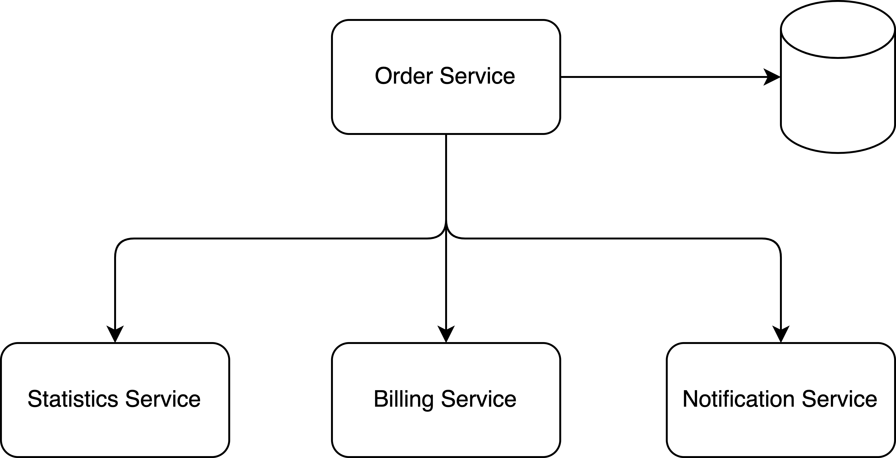
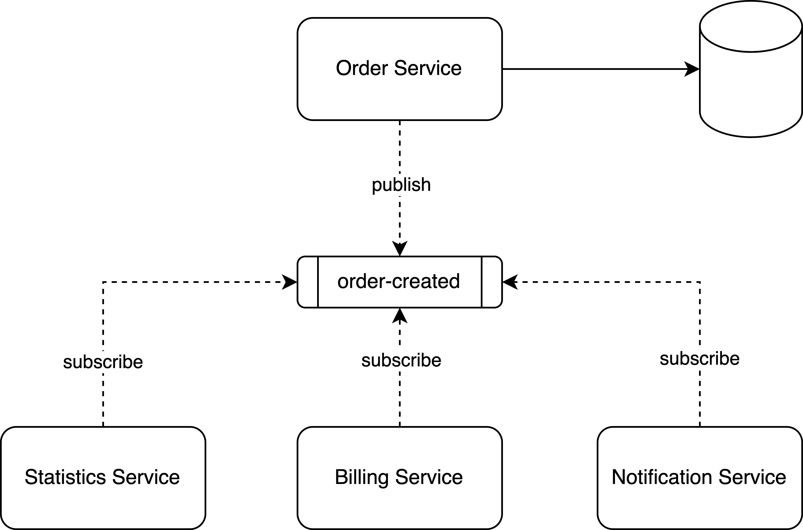
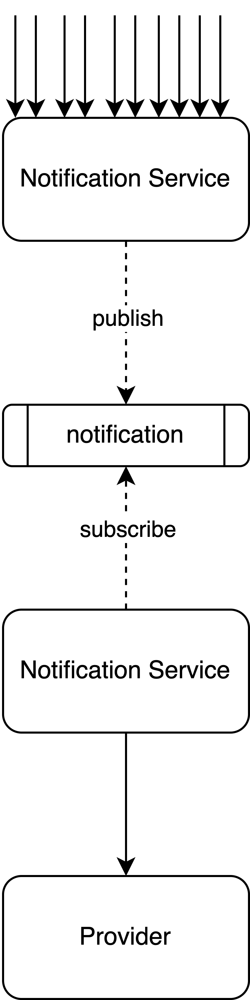

# Pub/Sub Practical Guide: Use Case
The Pub/Sub pattern is widely used in large complex architecture and serves different purposes. In this article, I will summarize the scenarios in that a message queue can be applied.

## Decouple service dependency and Asynchronous

To understand how Pub/Sub architecture benefit to this scenario, it is necessary to study a little about the architecture without Pub/Sub.

In this architecture, Order Service is tightly coupled with the other 3 services by invoking APIs. It causes 3 problems:

- Order Service needs to have a code change if now we don’t need to depend on Statistics Service
- The other 3 services’ response times are all accumulated to the Order Service response time
- Order Service needs to handle service unavailable issues for its dependencies

Now, how does Pub/Sub solve these problems?

We change the architecture to include Pub/Sub. Now, the Order Service will always publish an event if there is a new order. Interested parties subscribe to the topic and handle the event with their own logic.

If the statistics service no longer cares about order creation, it can remove the subscription and the order service does not change any code.

Since it is asynchronous now, the response times from other services will not accumulate to the Order Service and also the Order Service no longer needs to handle service unavailable issues for its dependencies, instead, it will be handled by the Pub/Sub.

> Can you guess what are the problems here after we adopt Pub/Sub architecture? Leave your thoughts in the comment below

## Avoid service being overwhelmed

Pub/Sub can also avoid overwhelming a service. Imagine we have 5K requests per second at peak hours and the notification service can only process 3K requests per second. If we allow the service to process all requests simultaneously, it will overwhelm the service.

By introducing Pub/Sub, we can temporarily store the requests in the message broker and consume the messages later. With this design, we can also have a stable consumption rate and avoid service overwhelming. In off-peak hours, the traffic is low and we can consume message backlog steadily.