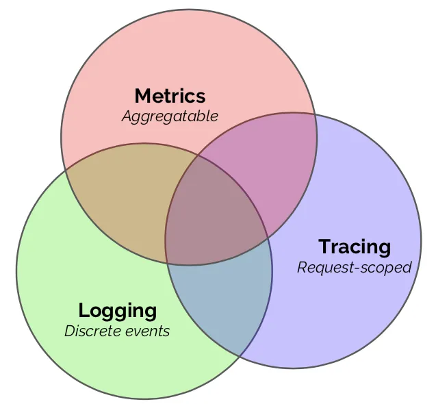
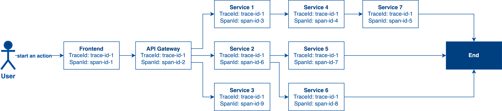

# Understand Observability

## What is Observability?
Observability is used to describe your system state so the software engineers can use that information to understand the system and identify issues.

In a microservices architecture, log and trace are the important components. It helps software engineers to understand the current system behaviors and debugging. It can also be used to observe the application’s performance like the daily error rate of a specific core API, how people use your application, etc.

Observability is mainly composed of the following 3 components:

### Logs
A log is an event with some descriptive elements like timestamp, log id, trace id, message, severity level and etc. It tells people what is happening in a particular action. A log is commonly in Plaintext or Structured format:

#### Plaintext
It is quite common to be used for logging but it is not search-friendly.

#### Structured
In a good logging system, it is not only a message but contains other metadata like IP address, custom fields for different actions and etc. That said, we want to enrich the log with meaningful data and catch what we need in different actions. Stripe suggests a good approach called Canonical Log Line which can help us aggregate the logs into a single log line per action per service.

### Traces
Trace is a series of events that represents the end-to-end journey starting from client initialize request to request end. With a microservices architecture, each event that happened in a single service is called Span. All spans connect together is called Trace. A trace can help you understand the system bottleneck, system break, service dependency, etc.

### Metrics
Metric is aggregated data within a time series including timestamp, value, and other meaningful data. It can be a graph to describe system performance, daily error rate, traffic, etc.

According to the diagram above, we can observe that a particular Trace is composed of many Spans. A trace can identify this whole series of actions that happened in the system and connect these spans together for better searching.

Also, from this diagram, we can know the service dependency of a specific API endpoint from upstream to downstream.

Apart from that, a Trace can also be used to measure the execution time between each service and visualize the request/event timeline from end to end. It helps software engineers to identify the system bottleneck.

## Conclusion
In conclusion, Observability is a very important component of a system and it includes Logs, Traces, and Metrics. It helps software engineers to understand the system behaviors, performance, and debugging.

 

<link href="https://fonts.googleapis.com/css?family=Cookie" rel="stylesheet"><a class="bmc-button" target="_blank" href="https://www.buymeacoffee.com/raychongtk">Buy me a coffee</a>

