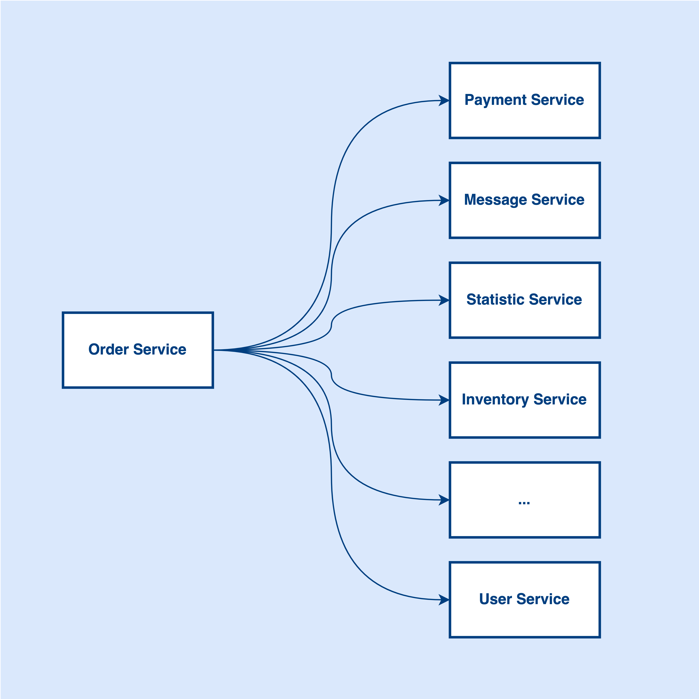

# Understand Software Complexity
In software engineering, we always need to deal with complexity no matter it is designing architecture or writing code. Basically, complexity can be grouped into 2 types:

- Accidental Complexity
- Essential Complexity

In the following sections, I will be explaining these 2 types of complexity. Okay, let’s get started!😎

## Accidental Complexity

This type of complexity is not from the original problem. It is just accidentally added to the solution when designing architecture or writing code. Simply put, this type of complexity is not necessary for solving the problem. It is from over-engineering or wrong design. That said, accidental complexity can be avoided by adopting the right design.

## Essential Complexity

This type of complexity is inherited from the problem. It is the essence of the problem that you need to resolve. That said, essential complexity cannot be avoided because it is the actual problem.

## Case Study

Imagine the order service relying on many other services say 20 services. Assume a lot of requests come to the message service and it affects the order processing time.

Also, we have multiple services that need to write databases and the database is slow because it cannot support that many requests. Now, you want to enhance the design to make order processing faster. Given that we accept latency for some non-important services. How would you solve this problem? 

Now, the problem is the API performance is not good enough, because we need to write data to different databases. It seems the database becomes the bottleneck of the application.

Would you design a high-performance architecture that supports 10K+ transactions per second (TPS) in terms of making the API response faster?

If you are going to do this, I would say you are making the wrong design/over-engineering the architecture. Basically, it is accidental complexity.

The problem is more like a service coupling issue although we have multiple databases written here. Since the order service relies on many other services and the processing time from other services is accumulated to the order processing time. So, the essential complexity is the service coupling issue.

To solve this issue, we can decouple the services and remove the unnecessary direct dependencies from the order service. For example, message service, statistic service, etc.

By introducing a message queue, we can decouple the service dependencies and create a loosely coupled architecture.

Now, we move the unnecessary operations out of the order workflow. When an order is placed, we publish a message to notify the subscribers. From the order service perspective, it does not care how the message/statistic service handles the order data. Instead, the message/statistic service needs to subscribe to the events that they are interested in and process them asynchronously.

> 💡 Do you know why do we prefer introducing a message queue against scaling the database and keep the current architecture? 

## Conclusion
Let’s wrap it up. I think when designing architecture, the most important thing is to understand the essence of the problem and dig into the problem and resolve it by using the right solution. Engineers should focus on the essential complexity and avoid accidental complexity. Understanding where the complexity from and what problems you are solving can definitely help you make the right decision when designing architecture.

 

<link href="https://fonts.googleapis.com/css?family=Cookie" rel="stylesheet"><a class="bmc-button" target="_blank" href="https://www.buymeacoffee.com/raychongtk">Buy me a coffee</a>

