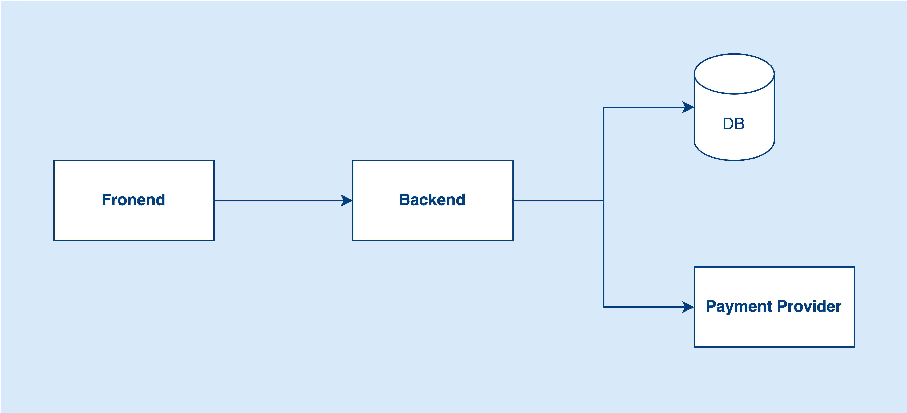

# Understand System Bottleneck
Do you know your system’s bottleneck? This is the question that every software engineer needs to ask themselves. When designing a system, you always need to know where is the bottleneck of the system. Otherwise, you can’t create a good system. When the problem comes, you don’t know how to solve it or prevent the problems.

## What is a bottleneck?

Basically, a bottleneck means if your system wants to process 1000 requests per second, but one of the components can only support 100 requests per second. Then that component will become the bottleneck of the system. Because that component limits the scalability of the system.

Imagine we have a six-lane road that can accept 6 cars in the road but in the middle, it becomes a two-lane road. Only 2 cars are allowed on the road. That said, the narrow road will become the bottleneck of the whole road. It might cause a traffic jam if the cars keep coming.

In short, a bottleneck is that your system wants to process N requests but actually it cannot process that many.

## Use Case
Do you know what are the bottlenecks of the below architecture?

I think most people will know there is a bottleneck between the frontend and backend. Let’s say the backend can process 1000 requests per second but now the frontend sends 3000 requests per second. Definitely, the backend cannot undertake that many requests.

### What can we do to mitigate the issue?

Scale the backend? Yes, we need to scale the backend first. If one backend can only support 1000 requests per second, then scale it to 3 backends or more.

Do you think scaling the backend from 1 to 3 can solve our problem? It really depends. Why do I say that? Let’s take a step back, do you know where is the bottleneck of the system?

Is scaling the backend from 1 to 3 really can solve the problem? Scaling the backend to 3 does not mean the backend can process 3x traffic. For example, if the system bottleneck is not in the Backend application itself but in the DB or Payment Provider. Now, you scale the backend application is useless because that component is not the bottleneck.

If the payment provider can only process 1000 requests per second, and it has a rate limit policy. Even if you scale the backend, the system still cannot process requests more than 1000 requests. Because the bottleneck is in the payment provider.

When the problem comes, scaling the backend is easy because it is stateless, we can do horizontal scaling. But for stateful components like DB or external dependencies like payment providers, it is hard to scale when the online issue happens.

## Conclusion
Let’s wrap it up here. When talking about bottleneck and scalability, we can’t just focus on the app itself but also need to take care of other components like cache, database, external dependencies, etc.