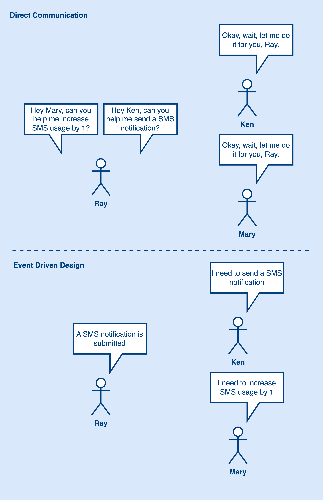
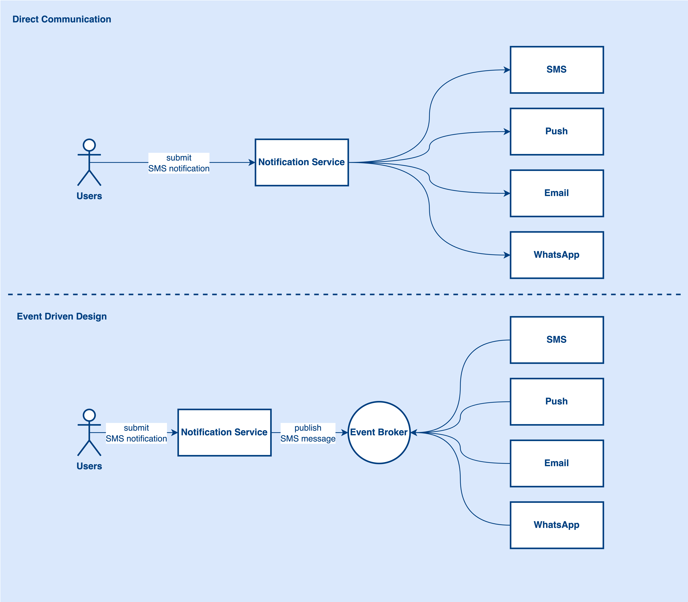

# What is Event-driven Architecture?
Event-Driven Architecture is a software design pattern that helps to decouple service dependency. It uses a publish and subscribe model to connect different components together. To help us understand what is event-driven architecture better, let’s take notification as an example.

## Direct Communication vs Event-driven Design

Using direct communication, Ray needs to ask Ken and Mary to do different work like increasing SMS usage by 1 and sending SMS notifications. Also, Ray needs to wait for Ken and Mary to get back the result. In this scenario, Ray is like a coordinator to organize everyone’s work. Imagine, if now Ken is going out to buy lunch and Ray needs to send an SMS. It is not possible to do because Ken is not available to help.

How can we make it better using Event Driven Design? In event-driven design, Ray does not need to talk to Ken and Mary directly. Instead, Ray just needs to leave a message in the Slack SMS channel to tell everyone in the channel that a new SMS notification has been submitted. After that, Ken and Mary will do their own work when receiving a request from the Slack SMS channel.

Let’s convert it to a more technical diagram. Now, we have a notification service to receive users’ notification requests.

In direct communication, the notification service will ask the SMS service to send an SMS request directly via HTTP call. The SMS service will then send the notification to the external SMS provider and the notification service will need to wait for responses from the external vendor and the SMS service.

> What are the drawbacks here? 
> - Longer response time because notification service needs to wait for its downstream to return the result.
> - If the SMS service is down, the requests will be lost.

With Event Driven Design, the notification service will not communicate with the SMS service directly. Instead, it will publish a notification message to the Event Broker.

Now, how can the SMS service know there is an SMS request that needs to be handled? As I mentioned in the very beginning, the event-driven design uses a publish and subscribe model. What the SMS service needs to do is to subscribe to the SMS topic. Whenever the notification service publishes a new notification message to the SMS topic, the SMS service will then listen to the SMS topic to consume the messages from the Event Broker.

Event Broker like Kafka has guaranteed the messages will be consumed at least once. If the message arrived at Event Broker successfully, it is guaranteed that the message will be consumed. So even if the SMS service is down, the messages are still in the event broker. Once the SMS service is back, it will start consuming again.

Any drawbacks to event-driven architecture? Yes, for example, the architecture becomes complicated after introducing an event broker. The team might need to study how to use an event broker like Kafka. Also, if users want to know the result of the SMS service, we need to use other approaches. Because it is not using direct communication now.

## Conclusion
Let’s wrap it up here. Event Driven Design is good for complex systems and mature teams. But there is no silver bullet in software engineering, introducing new technology to the architecture has both pros and cons. What you need to do is understand the actual problem and solve it with less accidental complexity. If the team accepts the cost, then just go for it.