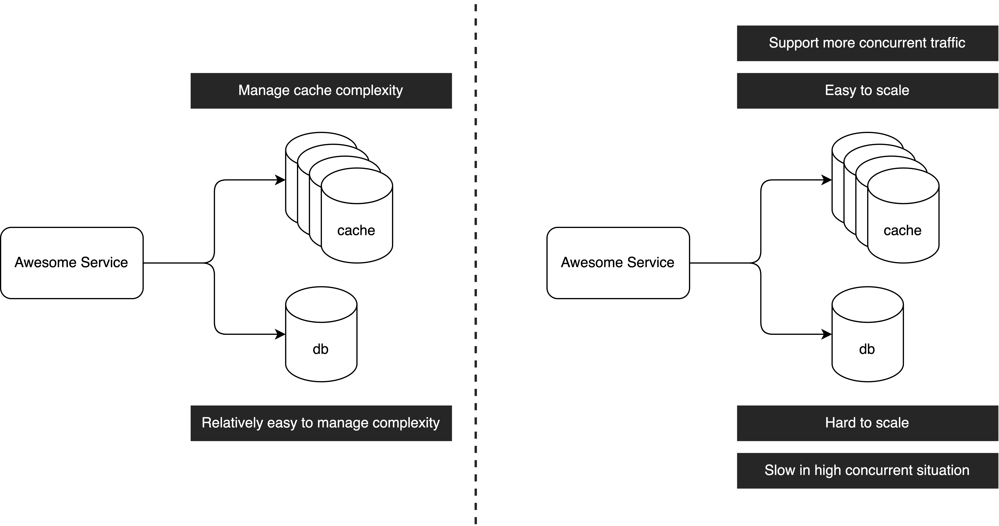

# Why Do We Need Architecture?
As software engineers, dealing with software architecture is crucial in our day-to-day work. It involves making decisions about components like caches, message queues, search engines, or even transitioning from a monolithic to a microservices architecture. While we may know how to implement these components, it's important to understand why we need them.

Let's consider the example of a cache. Some people believe that adding a cache can enhance read query performance, and since many popular companies utilize caches, it must be beneficial. While this may be true, it's essential to question whether your system truly needs a cache. Every architectural decision should be based on a specific reason. Well-known companies add caches to their systems because they have genuine needs, such as handling extremely high traffic where scaling traditional databases becomes challenging.

In my opinion, architecture revolves around managing complexity. The core aspect of architecture is solving problems with minimal resources and complexity. Adding a cache undoubtedly introduces complexity to a system. If your system doesn't require a cache, there's no need to blindly follow others. However, understanding why others implement caches and the problems they solve can provide valuable insights into designing your system.

Considering the cache example, the main reason for adding a cache is the improved read performance compared to traditional disk storage. However, the key message conveyed by caches is that scaling the cache component is easier than scaling traditional database storage. Additionally, caches can support higher concurrent traffic in high-traffic systems, thereby facilitating read performance.

In the context of a large traffic system, scaling a traditional database without using cache architecture can be extremely challenging in today's internet environment. Therefore, choosing a cache on top of a traditional database is beneficial because modern cache components support horizontal scaling, making it easier to scale compared to traditional databases like MySQL. While adding a cache introduces complexity, it is considerably less complex than scaling a traditional database.

In summary, software architecture is vital for managing complexity and solving problems efficiently. Understanding the reasons behind architectural decisions, such as adding a cache, helps us make informed choices based on the specific needs and challenges of our system. By evaluating the benefits and trade-offs, we can design systems that perform optimally in high-traffic environments while effectively managing complexity.

