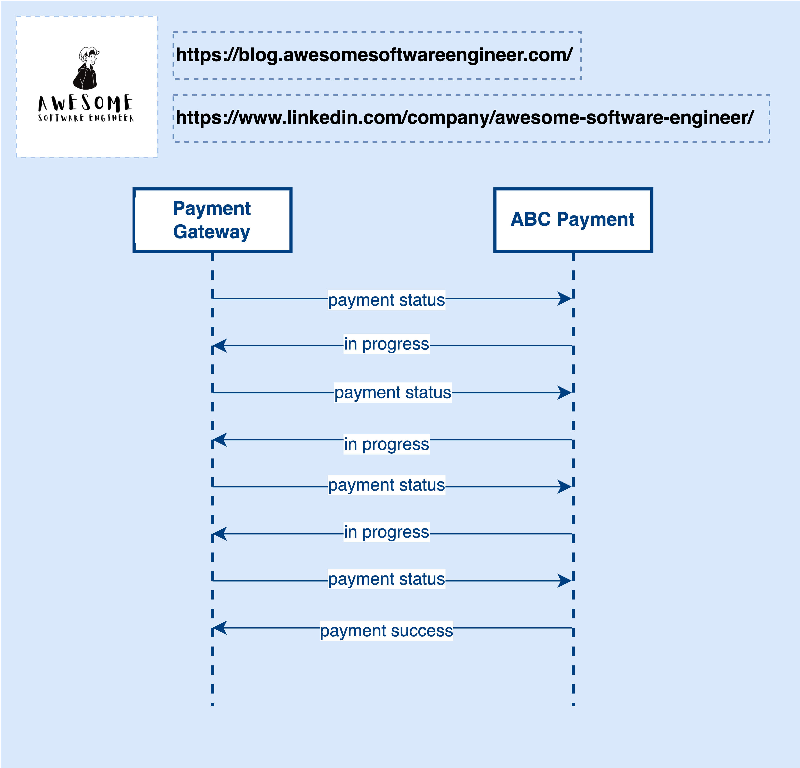
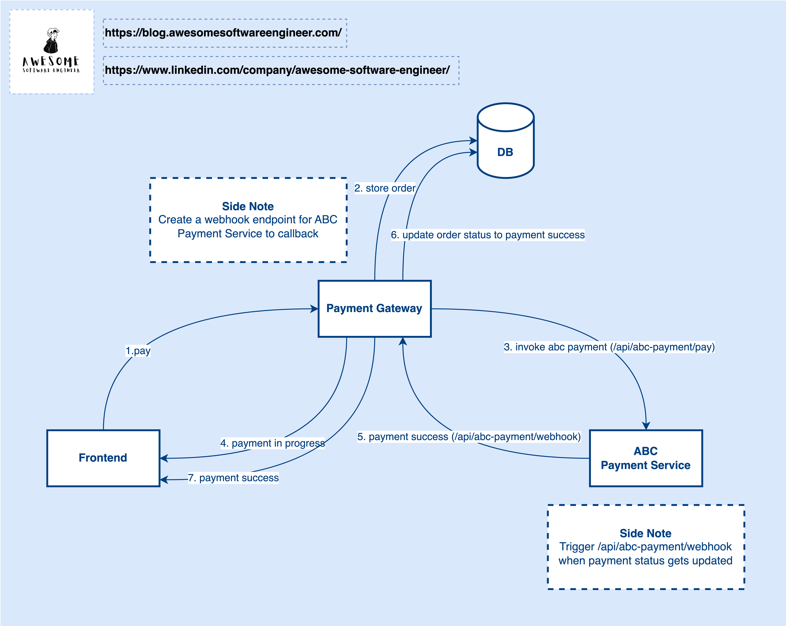

# Why Do We Need Webhook?
In my last post of 2022, I explained the difference between API and Webhook. Today, I am going to create an actual scenario and show you how to use webhook and why we need it.

Okay, let’s get started. Before talking about Webhook, I want to bring the API approach up first. Let’s take payment as an example.

## API

The diagram above shows how the API approach works. Using this approach, the payment gateway needs to query the external payment service — ABC Payment to ask if the payment is done. As you can see in the diagram, the payment gateway keeps asking ABC Payment about the status of a specific payment. After 4 times, the payment gateway gets a success status from the ABC Payment.

What is the drawback of this approach? Can you think about it?

> Ask yourself a question: How frequently the payment gateway will call the ABC Payment?

This is unknown because the payment gateway does not know when the ABC Payment can finish a payment operation.

If the payment gateway requests the ABC Payment too fast, it will cause a waste of resources on the payment gateway side. If the payment gateway requests too less, it will increase the payment latency.

This approach is basically a pull model when 2 systems communicate with each other. Everything is controlled by the payment gateway side, but actually, the resource status is owned by ABC Payment. A consumer (Payment Gateway) never knows when the data will be updated on the provider (ABC Payment). If a consumer sends 10 calls to the provider, the first 9 calls will be wasted, and only the last one is valid. So, the pull model is not suitable for this use case.

## Webhook
To solve this problem, we can use a push model which is Webhook.

Now, ABC Payment does not need to provide an API for their consumer. Instead, ABC Payment requires its consumers to provide an API for webhook callback. After the Payment Gateway invoked ABC Payment, the ABC Payment will trigger the webhook to callback the payment gateway when there is any payment status update event that happens on ABC Payment. After receiving the payment status from the ABC Payment, the Payment Gateway will update the payment status accordingly.

That said, the event trigger is now controlled by the ABC Payment instead of the Payment Gateway. Now, the consumer does not need to manage the request frequency. Instead, it is managed by the provider.

From the consumer’s perspective, it just focuses on how to consume the data when the data is pushed to the consumer and does not need to manage extra complexity. 

On the other hand, from the provider's perspective, it needs to handle the high request rate when the consumer requests too fast in the pull model but now, it just needs to send a callback request to its consumers when the payment is done.

## Conclusion
Let’s wrap it up. Using the right technology to solve the right problem can let the developers focus on the essential complexity which is the actual business problems. As you see, the architectural complexity decreased a lot on both sides by using webhook. The consumer does not need to design a scheduled job to query the provider while the provider does not need to worry about the consumer requesting too many.