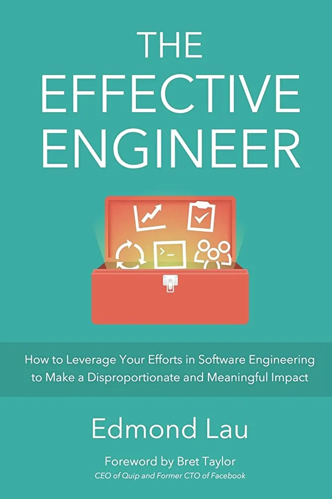
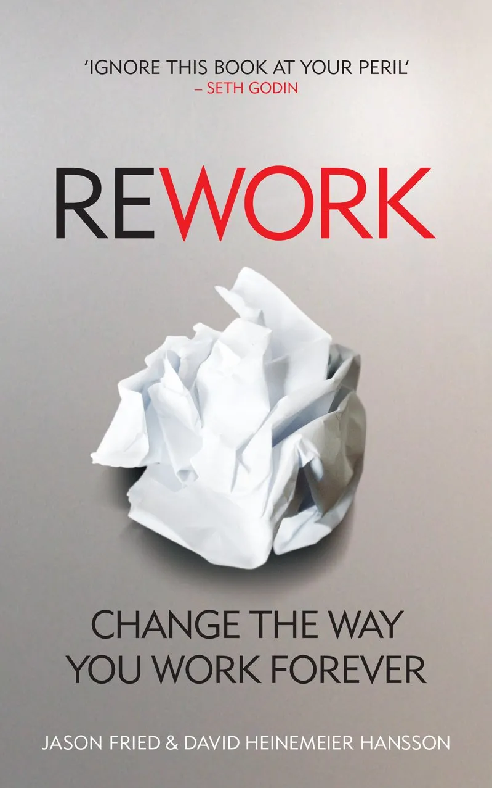
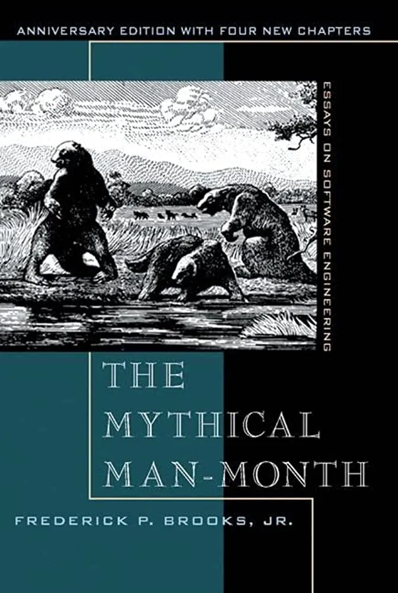

# 3 non-technical books that influenced me
Nothing technical this week. I would like to recommend 3 non-technical books that I think it is worth reading as a software engineer.

## The Effective Engineer

https://www.effectiveengineer.com/book

This book provides practical advice and insight for software engineers to become more effective including time management, prioritization, and career development. Also, it emphasizes the importance of business value and the impact of software engineering work. If you are looking for something that helps you scale yourself, this book might be useful to you.

## Rework

https://www.amazon.com/ReWork-Change-Way-Work-Forever/dp/0091929784

This book talks about product development, hiring, company culture, and productivity. It promotes the concept of “less is more” and emphasizes simplicity, focus, and efficiency. This book is suitable for many people including people who want to build a team, people who want to develop a good product, and people who want to learn how to focus and improve efficiency.

## The Mythical Man-Month

https://www.amazon.com/Mythical-Man-Month-Software-Engineering-Anniversary/dp/B005GM4EBS

This book explores the challenges of managing a large complex project. It talks about project management, the work approach in a team, and communication. 

I like this sentence very much:

> “Men and months are interchangeable commodities only when a task can be partitioned among many workers with no communication among them” said by the author. 

This book is suitable for people who want to learn project management and communication in a team.

 

<link href="https://fonts.googleapis.com/css?family=Cookie" rel="stylesheet"><a class="bmc-button" target="_blank" href="https://www.buymeacoffee.com/raychongtk">Buy me a coffee</a>

