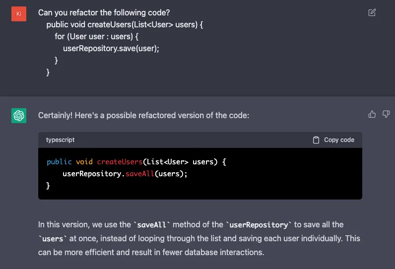
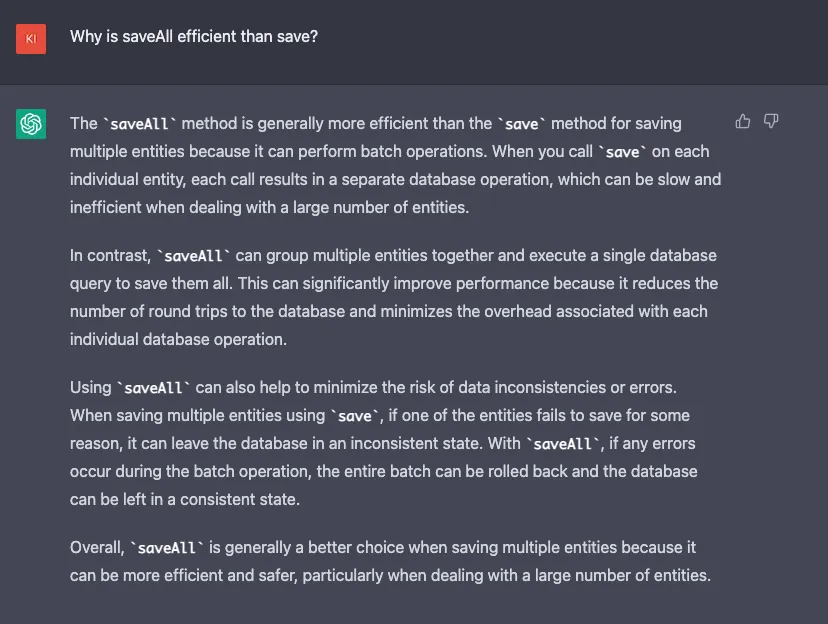
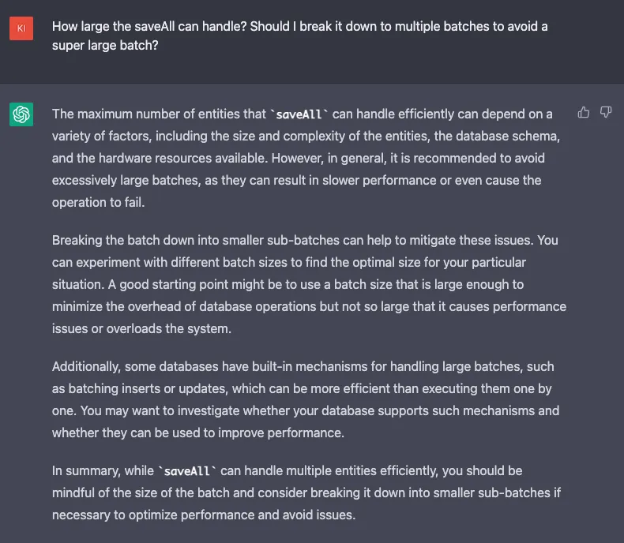
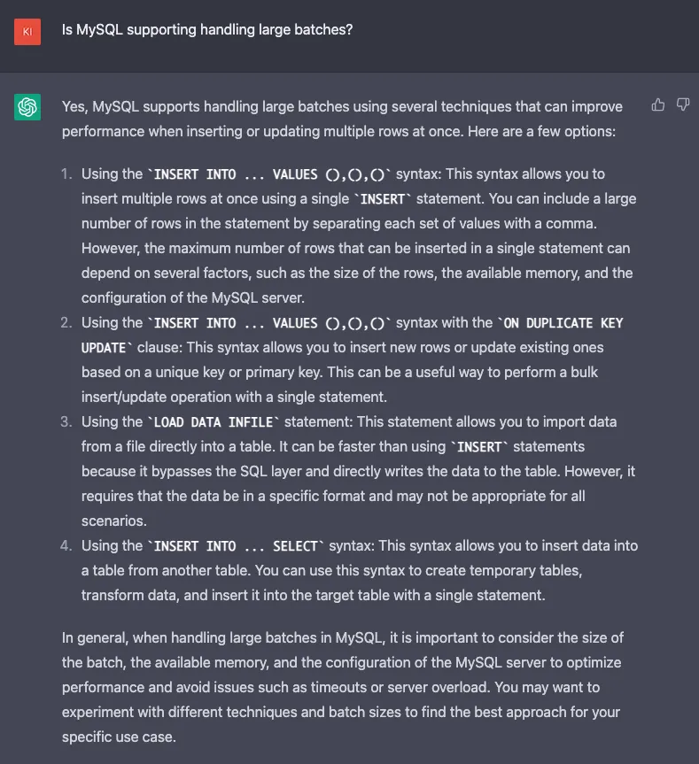
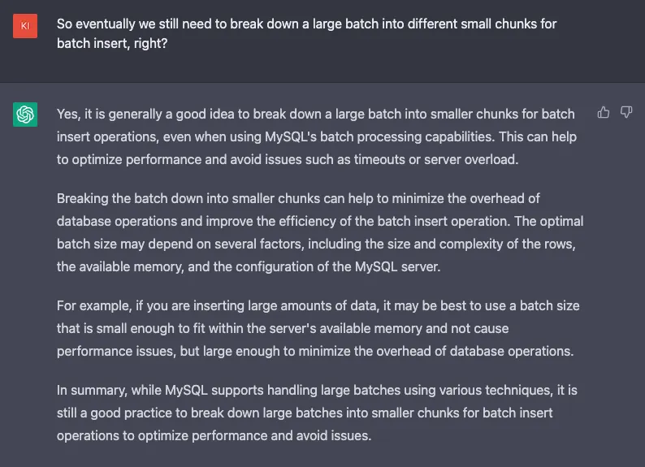
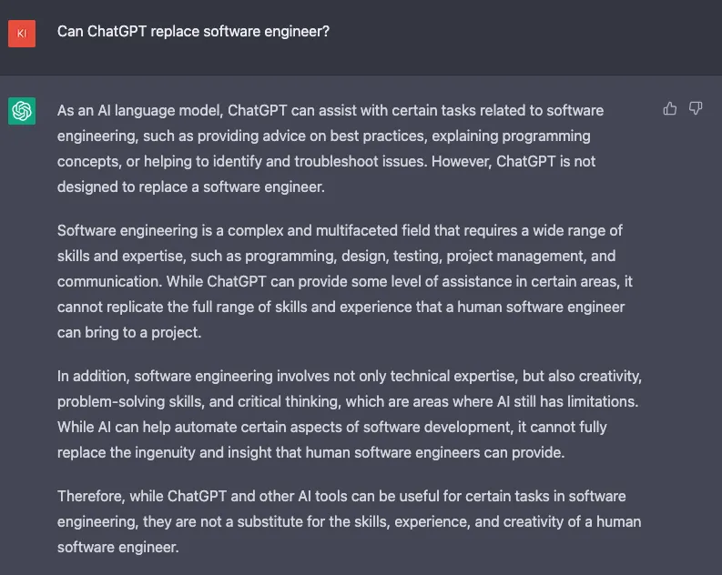

# Chatbot Driven Development

Today, let’s explore a little bit about how ChatGPT can help software engineers to boost their productivity and mentor inexperienced software engineers. There is a term called Chatbot Driven Development. That said, we can ask the chatbot to help us refactor our code or give the advice to facilitate our job. Let’s get started with ChatGPT.

My first question to ChatGPT was asking it to help me refactor my code for inserting a list of users into the database. In my original version, I intentionally use save method with a for-loop instead of using saveAll.

ChatGPT can help me correct my code and make it more efficient. Also, it explained a little bit about why it is efficient.

After that, I asked another question: Why is saveAll efficient than save?

ChatGPT is able to explain the idea behind save and saveAll; why saveAll can help improve code performance and some potential risks when using save for batch insert.

To extend the topic from the code level to the database level, I asked how large a batch can be handled in saveAll?

ChatGPT can answer it clearly and concisely and also bring out some databases that can handle large batches.

I further asked whether MySQL can support handling large batches or not.

ChatGPT can provide some options to me and also pointed out we still need to consider memory and configuration of the MySQL server.

I asked my last question to confirm the answer.

In my opinion, when asking questions, ChatGPT can summarize the answer and give you the answer directly. But if you don’t know what to ask, ChatGPT might not be able to tell you the details. I feel like it is like a mentor for you to ask questions. If your command is clear, then ChatGPT definitely can help you boost your productivity and help you clear some software engineering concepts.

Also, its ability for refactoring code is also good if you can give it some concrete commands. But if you don’t have the skill to judge whether its answer is correct or not, it might have a problem when using it. So, I think building a good software engineering foundation is still important for software engineers. (To build a good software engineering foundation, you can subscribe to Awesome Software Engineer💡) 

ChatGPT is a tool to help you do better instead of replacing you. In reality, companies still need humans to judge whether the code is correct but ChatGPT can give software engineers some insights into software engineering topics. If software engineers use this tool correctly, I am pretty sure that ChatGPT can boost engineers’ productivity in solving some common problems in the software engineering area.

 

<link href="https://fonts.googleapis.com/css?family=Cookie" rel="stylesheet"><a class="bmc-button" target="_blank" href="https://www.buymeacoffee.com/raychongtk">Buy me a coffee</a>

