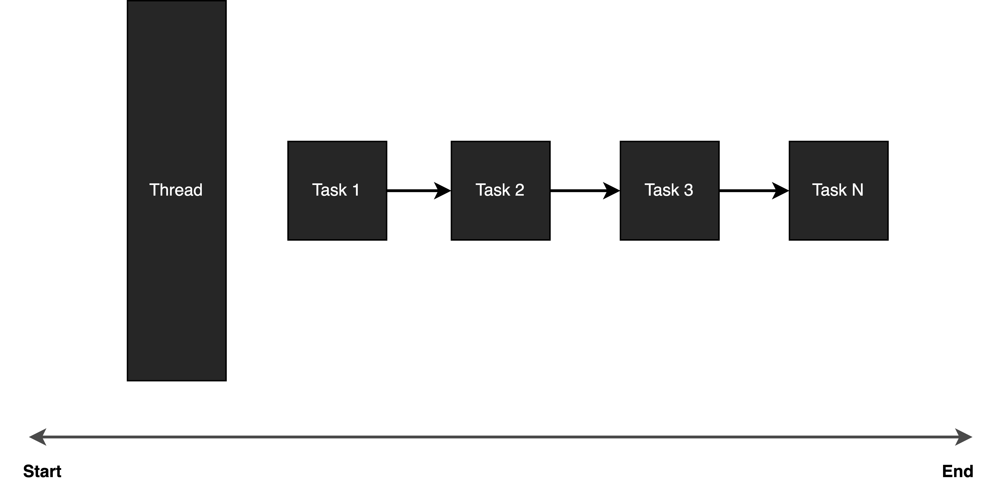
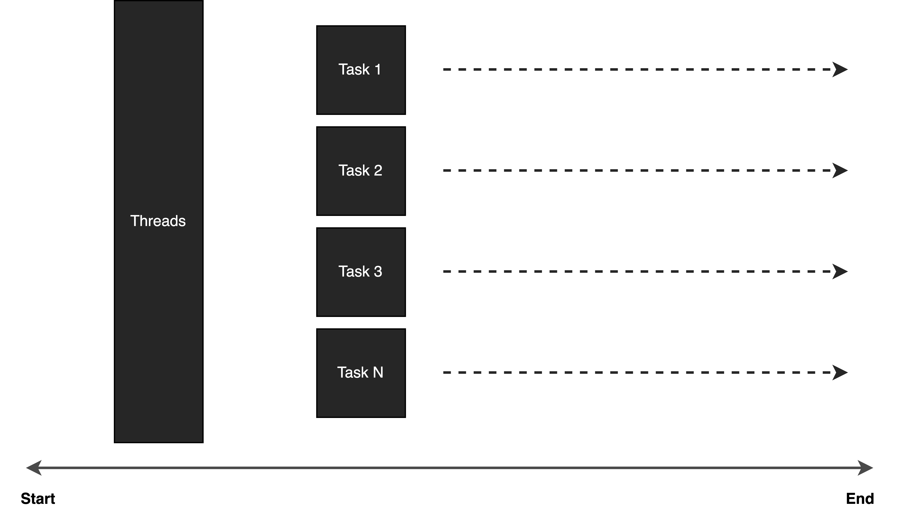

# Serialization vs Parallelization
## Serialization

Serialization means executing a series of tasks one after the other within a single thread. In other words, these tasks are executed sequentially, with one task starting only after the previous one has completed.

### Pros

- **Simple:** Serailization is simple and straightforward to implement.

- **Resource Efficiency:** Unlike a multithreaded program, serialization uses a single thread to handle a series of tasks, so it requires fewer system resources.

### Cons

- **Slower Execution:** It executes the tasks one by one. So, it only starts a new task when the previous task has been completed.

- **Inefficient Resource Utilization:** Serialization may not efficiently utilize system resources in a system with a multicore CPU.

## Parallelization

Parallelization means executing a series of tasks in multiple threads, one task is assigned to a dedicated thread. In other words, these tasks are executed in parallel. This approach allows for better utilization of multiple CPU cores and can lead to improved performance and responsiveness in applications.

### Pros

- **Improved Performance:** One of the primary benefits of parallelization is improved performance. By executing tasks concurrently on multiple CPU cores, you can significantly reduce the overall execution time of a program.

- **Resource Utilization:** Parallelization efficiently utilizes available hardware resources. It enables better use of multi-core processors and can lead to more efficient resource utilization in distributed computing environments.

### Cons

- **Overhead:** Managing threads comes with overhead, including context switching and memory usage. This overhead can offset performance gains for small tasks.

- **Complexity:** Parallelization introduces complexity into software design. Managing multiple threads, coordinating their activities, and handling synchronization can be challenging.

- **Debugging:** Debugging parallel code can be more challenging and time-consuming. Issues may be difficult to reproduce and diagnose.

## Conclusion
In summary, they both have their pros and cons. Choose the approach wisely depending on different use cases. The key is to understand the nature of your tasks and the trade-offs involved. In many cases, a combination of both techniques may be appropriate. Ultimately, the choice should align with your application's specific needs and goals.

 

<link href="https://fonts.googleapis.com/css?family=Cookie" rel="stylesheet"><a class="bmc-button" target="_blank" href="https://www.buymeacoffee.com/raychongtk">Buy me a coffee</a>

