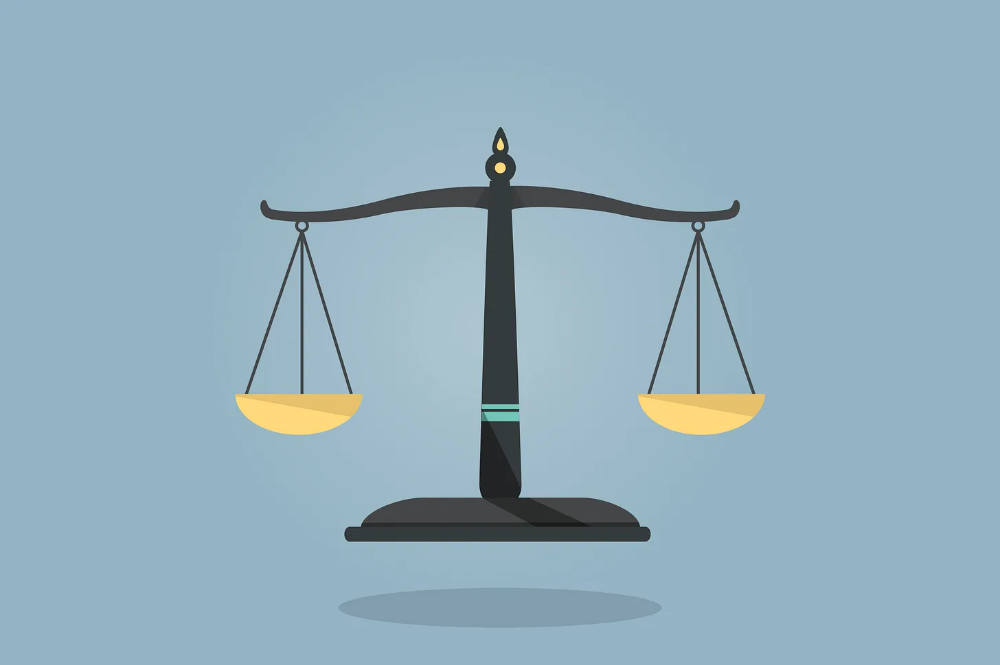

# Everything is a trade-off

Software engineering is all about choosing the right trade-off. No matter it is designing software architecture or writing code. Everything is a trade-off. There is no perfect solution. You always need to pick the right trade-off in your day-to-day routine.

One of the examples is Performance vs Readability when writing code. Sometimes, if you choose Performance, you might lose some readability in your code, and vice-versa. Imagine if you are going to write an API with some high-performance algorithms. Now, things are getting complicated when using some complex algorithms in the code. Not everyone can understand your assumption and algorithm logic.

What would you do? Should you go with Performance or Readability? That’s the trade-off. Which one is right? It depends on which one your team thinks is important. If you go with Performance and your team can afford the price that losing the Readability, then that’s it. Most of the time people want Readability more than Performance but if it affects a lot of user experience, people might go with Performance and sacrifice Readability. Software engineers should find the balance between Performance and Readability in terms of maintaining a reasonable performance and making people’s life easier when reading the code.

Another example is Distributed Transactions in microservices. In a microservices architecture, there might have many scenarios that need Distributed Transactions to ensure data consistency. But implementing Distributed Transactions is expensive. Would you implement it in every scenario? My answer is no. It needs a lot of tech effort and is hard to maintain the code. It will affect the team’s development velocity and the whole solution is complicated. In most of the scenarios, we don’t implement distributed transactions because the team cannot afford the price and it seems not valuable to implement distributed transactions in every possible scenario. Sometimes, we need availability more than consistency. So for this type of scenario, we just let it go. If it really happens, we just fix it manually. That’s the trade-off that software engineers need to consider in their daily routines.

What I have seen in my jobs is that people always think about designing a perfect solution to solve all the possible cases including edge cases. Eventually, they over-engineer the whole solution. What they are thinking is making the solution automated without human effort. I think this is good but it should depend on how much effort the team needs to put into the solution and whether is it valuable to put that much effort to solve an extreme edge case?

Personally, I think we need to balance these 3 things:

- **Product Timeline:** is the time that we spend on the solution acceptable for different product stakeholders?

- **Performance:** is the performance not acceptable?

- **Developer Experience:** is the solution hard to understand for other software engineers?

These factors will affect how you design the solution and we always need to balance these things. My idea is always to leave some room for the solution. Also, focus on essential complexity and iterate the solution when needed.

Would you put 10x tech effort to solve an extreme edge case? or manually fix the edge case within a few minutes? Let me know your thoughts in the comment section.

 

<link href="https://fonts.googleapis.com/css?family=Cookie" rel="stylesheet"><a class="bmc-button" target="_blank" href="https://www.buymeacoffee.com/raychongtk">Buy me a coffee</a>

