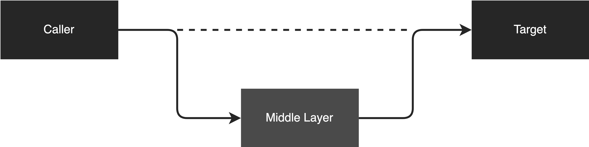

# Any problem in computer science can be solved by another layer of indirection 

> David Wheeler: Any problem in computer science can be solved by another layer of indirection.

Recently, I saw this quote on the internet, and it is really inspiring. I started thinking if this quote is really valid. Actually, Indirection means adding an extra layer. This technique is to decouple the dependency between the client and the target. To verify the idea, I defined several scenarios, and let's take the following examples to validate if the idea is really valid.

## Example 1: Code Complexity

Let’s take code complexity as our first example. Imagine if we have a method with thousand lines of code. It is hard to understand, right?

So, can we add another layer to solve this problem? The answer is Yes.

We can extract the complex logic into different classes to shift the complexity and balance the complexity in different places.

After that, we compose all the classes together to form the actual functionality.

## Example 2: Traffic Pressure

Imagine if your app is facing a traffic pressure problem and it cannot handle that many requests during peak hours. 

Can this problem be solved by adding another layer? The answer is Yes.

Let’s say we introduce Kafka into the app. The request now will not process synchronously, instead, it will go to Kafka and process asynchronously. That said, Kafka is the “another layer” to solve this problem. The requests will be stored in Kafka until a consumer consumes them.

Another example is caching. Imagine a lot of “Read” requests hitting the database directly and the database becomes a system bottleneck now. To solve this problem, we can introduce another layer which is the cache layer to cache the data. Now, the requests will not hit the database directly if it is in the cache. Then, we can mitigate the database pressure.

## Example 3: Incompatible Interface

Imagine we are integrating 2 systems together, system 1 generates an XML file and system 2 receives a JSON file. Now, the interface is not compatible. You can’t pass an XML to a JSON interface.

How would you solve this problem? The answer is adding another layer.

We can introduce a data conversion layer to convert an XML file to a JSON file and pass the converted JSON file to system 2.

## Example 4: Add Extra Behavior

Imagine if you are working on a business project, and you need to create a bunch of APIs. On top of the APIs, you want to add extra behavior like logging for every API. But, you don’t want to put logging into the API business logic because it will mess up the business logic.

To solve this problem, we can add another layer. We can use Aspect-Oriented Programming (AOP) to solve the cross-cutting concern. By adding another layer, we don’t need to mess up the business logic but still have API logging capability in another layer.

 

<link href="https://fonts.googleapis.com/css?family=Cookie" rel="stylesheet"><a class="bmc-button" target="_blank" href="https://www.buymeacoffee.com/raychongtk">Buy me a coffee</a>

