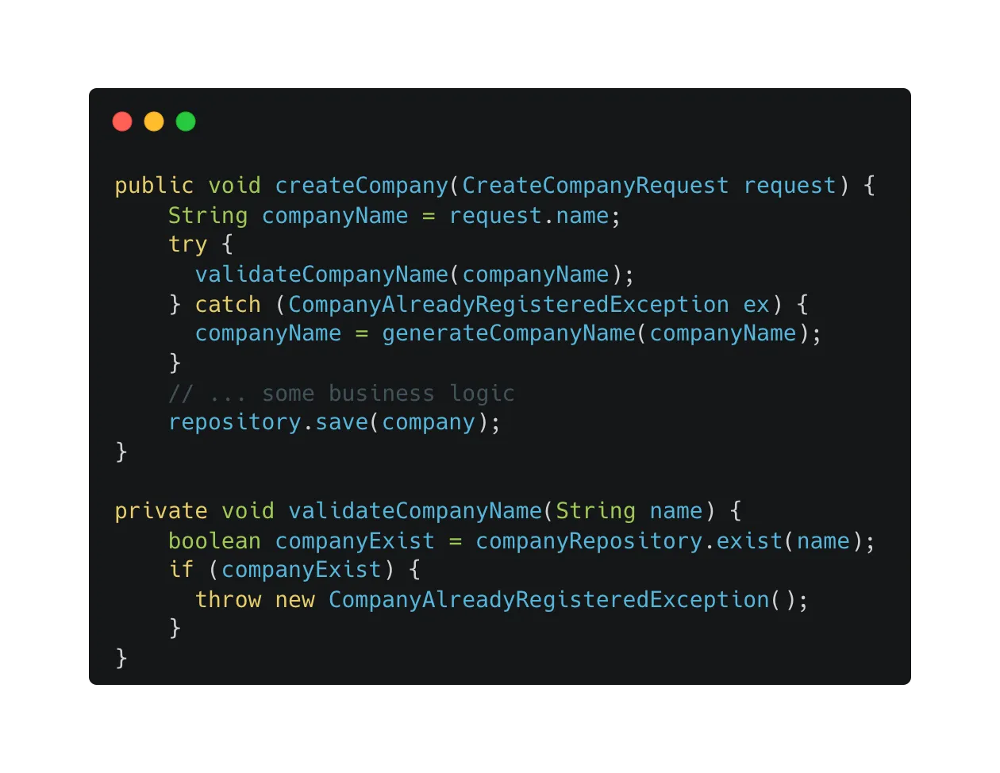
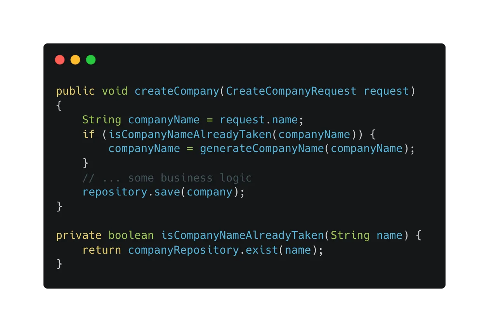
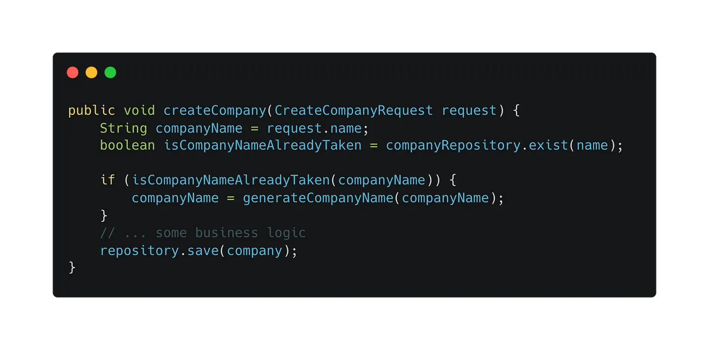

# Avoid throwing exceptions as control flow
The exception is a mechanism to stop unexpected behavior in software development. When we get an unexpected behavior, we tend to throw an exception and let the exception handler process the error and return an elegant error message. But, I have seen developers abuse the exceptions in expected behaviors. For example, before creating a company, we need to validate if the company name is already taken. In this example, a company name getting registered by another user is possible and expected. 

In the code snippet above, we throw an exception in the validation method and have a try-catch block on the caller method to handle the alternative flow.

Is this really a good practice? Let’s think about it.

Personally, I think it is abusing exceptions. Because this behavior is allowed and expected in the requirement. Also, wrapping a try-catch block affects code readability and looks like there is an error occurs but actually it is not an error. It is quite misleading for readers. So, I think this style is not good and we should not throw an exception here.

Now, we refactor the code structure to the below version which I think is better than the above and more descriptive:

In this refactored version, we remove the exception and try-catch block. Instead, we return a boolean in the validation method and rename it to *isCompanyNameAlreadyTaken(…)*. After that, we use the if statement to validate whether the name is taken or not. If it is already registered by someone, we generate a new name. Now, the logic and code structure both looks better than the previous ones because we removed the misleading information from the code. Also, the method name is more descriptive and the code structure is simpler. In this particular example, we can also inline the *companyRepository.exist(name)* method in the *createCompany* method to further simplify the code structure.

To sum up, if the behaviors are expected, try not to use exceptions. We can use the control flow statement to handle the logic. If you throw an exception and handle it by yourself, why don’t just use the control flow statement to do the decision-making? There is no silver bullet for all use cases, in this particular use case, using the control flow statement is definitely better than throwing an exception. When implementing exceptions, if you have doubts, go backward and think again.

 

<link href="https://fonts.googleapis.com/css?family=Cookie" rel="stylesheet"><a class="bmc-button" target="_blank" href="https://www.buymeacoffee.com/raychongtk">Buy me a coffee</a>

