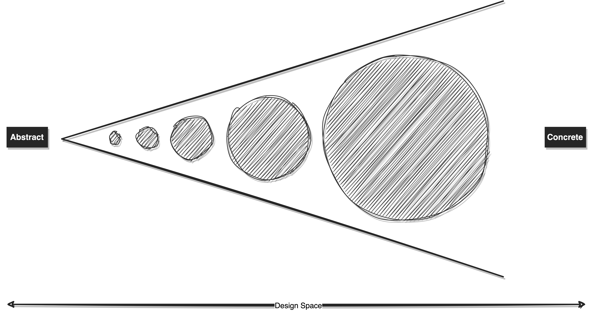

# Design Space Optimization

In the realm of software engineering, two contrasting development approaches emerge: abstraction-driven design and simplicity-focused design.

- **Abstraction-driven Design**

People who champion the abstraction-first method are all about thinking ahead. They're like the fortune-tellers of software - they try to predict future needs and design solutions that can be reused down the line. It's like building a universal toolkit for future problems. But here's the kicker: these predictions are made in a complex, ever-changing business world. Sometimes, reality takes a different route, and suddenly that fancy design doesn't fit the puzzle anymore and leads to a rigid design that is hard to adapt.

- **Simplicity-focused Design**

On the flip side, we've got the keep-it-simple believers. They're the pragmatists of the software engineering world. They say, "Hey, let's not complicate things until we have to." They build straightforward, no-nonsense solutions that are easy to wrap your head around. These guys are all about preserving design space for future extension. It's like having a roomy backpack that you can stuff with new tools whenever you need them. Of course, this approach comes with a catch – you need to roll up your sleeves and refactor stuff every now and then to stay up to date with the ever-changing business scene.

The diagram depicts the trajectory of the simplicity-focused approach. Beginning with a specific and tangible design, this methodology iteratively hones the solution over time. This approach resonates with scenarios where simplicity offers greater appeal than elaborate abstraction, except when abstraction genuinely simplifies matters.

In a rapidly expanding product company, simplicity in design is key to allowing ample space for future iterations. Given the swift evolution of product requirements, a simple design approach is preferred. Delving too deeply into future possibilities from the outset can inadvertently constrain the design space, complicating understanding for others. This occurs when code becomes overly abstract and generalized.

To elaborate, "abstract and generic" signifies an intention to address multiple potential problems, whereas "concrete and specific" pertains to addressing a singular issue. Applying a versatile solution to a single problem elevates cognitive load – the mental effort required to comprehend the intricacies. Striking a balance between abstraction and specificity thus emerges as a crucial consideration in managing the design space effectively.

The trade-off is evident: increasing abstraction might obscure comprehension due to numerous assumptions embedded in the design. Consequently, it reduces future expansion possibilities and amplifies the ripple effect of logic changes. In contrast, starting with a concrete solution promotes clarity, facilitating accessibility even for individuals lacking specialized backgrounds. This approach also fosters a more expansive design space, conducive to accommodating future extensions. Adaptation to evolving business needs can be achieved through strategic refactoring.

It's crucial to recognize that design space contracts over iterations as complexity accumulates. Establishing a refactoring culture becomes paramount to maintaining a reasonable design space and ensuring future extensions remain feasible. Typically, a concrete solution offers a broader design space, whereas abstraction's inherent assumptions restrict it.

If you're finding it challenging to make changes when new requirements pop up, that could be a sign that your code needs some refactoring. It suggests that your design space might be too limited, making it tough to make necessary iterations smoothly.

In conclusion, software engineering offers two distinct approaches: abstraction-driven design and simplicity-focused design. Striking a balance between predicting future needs and maintaining adaptability is key. The challenge lies in managing design space as complexity grows, necessitating occasional refactoring. Agility, openness to change, and a pragmatic mindset are essential for optimizing design and creating resilient software solutions that can evolve alongside evolving business requirements.