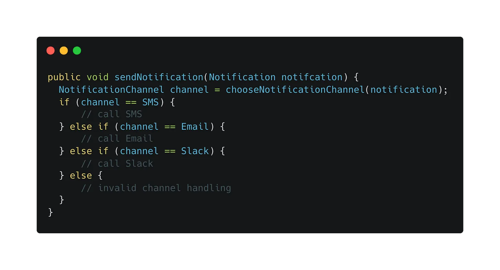
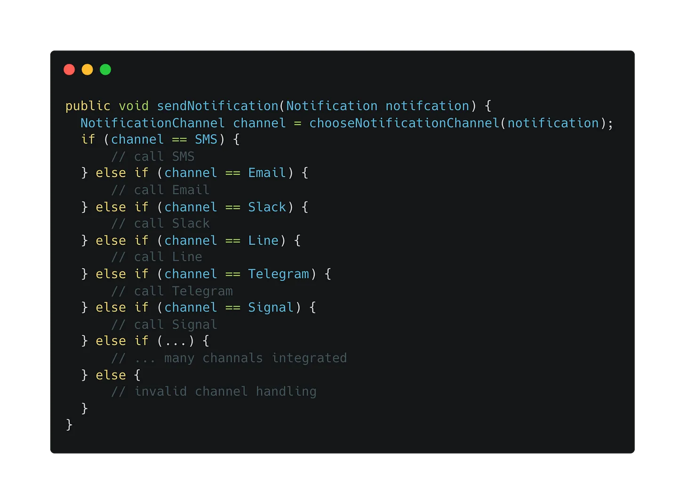
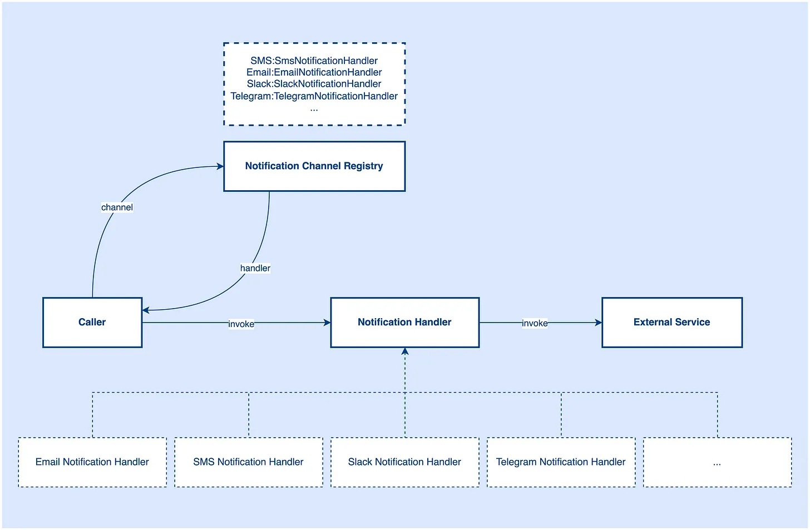
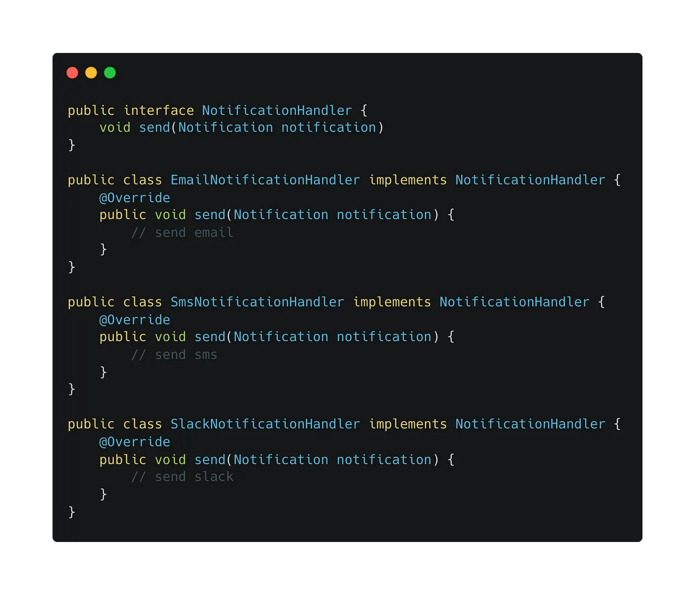
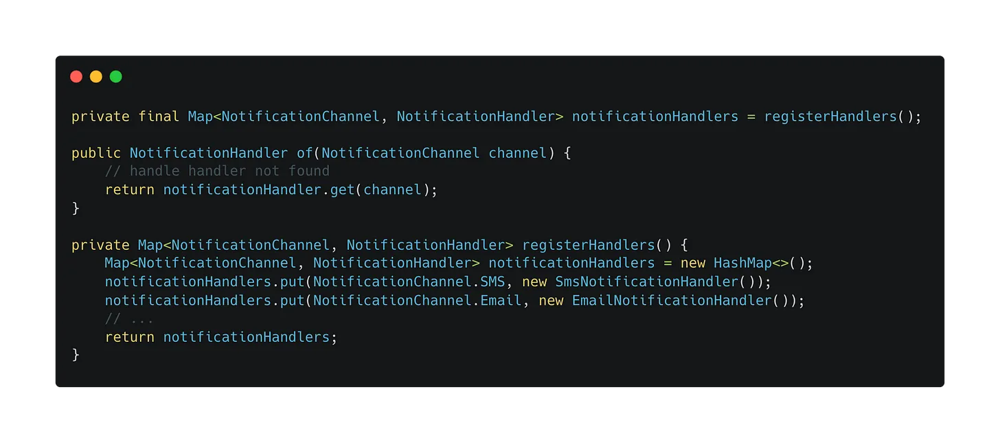
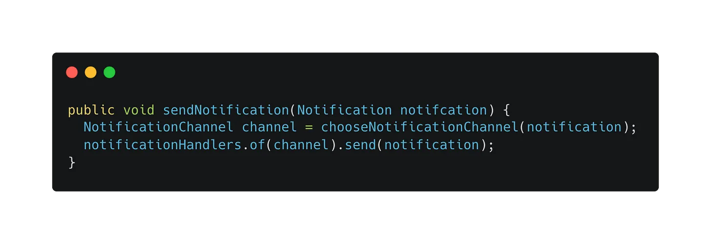

# Gracefully handle dynamic behaviors in the same category
As software engineers, you might need to handle different behaviors in the same category in your day-to-day work.

Imagine if you are working on a notification integration service and there are different communication channels including SMS, Email, and Slack that needs to be integrated into the system.

How do you organize your code to route a notification to different channels?

The first thing that comes to our mind is the control flow statement. We can use the simple if-else statement to make the decision in choosing different channels.

It is good to keep things simple at the beginning stage and seems this is the best choice at this stage because we have 3 communication channels only. Writing simple if-else is the most straightforward and readable approach.

Few months pass. Now, the requirement changed. The product manager plans to add more communication channels to support the operation, for example, Line, Telegram, Signal, and some other else channels. The communication channels getting more and more. Every time we integrate a new communication channel, the caller method needs to update the control flow statement and the decision-making flow is getting longer and longer.

When looking at the code above, it seems the caller method is too complicated now. Also, does the caller method care about these implementation details? Probably not. The control flow is stable, only the implementation is different. Imagine you are reviewing the caller method, do you really care about the implementation of different channels? Probably what you care about is how to determine the notification channel and how to compose a notification message. For sending a message to an external, we don’t really care the sending behavior as long as the app can send the notification out.

Having these assumptions, we shouldn’t put the decision-making flow and implementation details in this caller method because it increases the complexity of the caller method and people do not really care about the details.

To solve this problem, the Strategy Pattern comes to the rescue. We can abstract a notification handler with common attributes and encapsulate the implementation details into different notification handlers like EmailNotificationHandler, SlackNotificationHandler, SmsNotificationHandler, etc.

Next step, we can have a registry class for registering channels and handlers and it will be a map data structure. A channel will be mapped to a specific handler.

Now, you can simply look up a notification channel through this map. The logic in the caller method will become something like this:

Basically, we are adding one more layer to shift the complexity from the caller method to the downstream. In the future, if more new channels add to the app, we don’t need to touch the caller method. What we need to touch on is creating a new notification handler for that channel and registering the implementation into the registry class. The strategy pattern brings some abstraction cost to the codebase but the complexity of the strategy pattern is not very high, most of the teams are able to pay the cost.

This pattern is very useful to organize different behavior in the same category. Another example is the payment channel. Imagine if you need to integrate different payment gateways into your app, you will have the same situation as the above notification channel scenario.

When the complexity gets large, we tend to shift the complexity to different places to mitigate the overall complexity in a particular place. It is common in software engineering, we are always making trade-offs in our day-to-day work.

> For more information about the strategy pattern, check out: https://refactoring.guru/design-patterns/strategy

###### Any design choice has a cost, it is not a free product. So, use the design pattern only if the price is acceptable and your team is willing to pay the price.

 

<link href="https://fonts.googleapis.com/css?family=Cookie" rel="stylesheet"><a class="bmc-button" target="_blank" href="https://www.buymeacoffee.com/raychongtk">Buy me a coffee</a>

