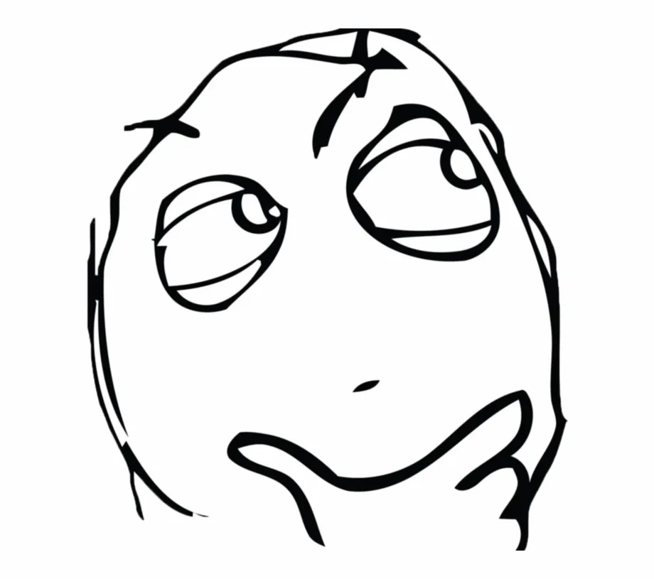

# Prefer Duplication over Wrong Abstraction

In software development, engineers tend to create abstractions to make the code reusable and avoid duplication. It is good in most of the use cases but remembers, the product requirement is changing fast, if you create an abstraction at the very beginning, you are very likely to fall into a trap — **The Wrong Abstraction**. 

If you keep working on the wrong abstraction, in the end, you will lose control of your codebase. No one can understand the codebase and you need a lot of documentation, comments, and diagrams to help you understand the existing behaviors. In order to reduce a few lines of code but create a wrong abstraction, it will make your code **incomprehensible and unmaintainable**.


Isn’t it Code as Documentation?

Imagine one of the use cases:

Engineer A sees a duplication in the codebase, he abstracts it

```java
public void doSomething(String param1, String param2) {
    // A...
    // B...
    // C...
    // D...
    // E...
}
```
Time passes and new requirements come

Engineer B sees the new requirements almost fit the current abstraction and he adds one more parameter to determine the flow

```java
public void doSomething(String param1, String param2, boolean flag) {
    // A...
    if (!flag) {
        // B...
    }
    // C...
    // D...
    // E...
}
```

Now, another requirement comes

Engineer C adds one more parameter to the code and introduces another condition to cater to the new requirement
```java
public void doSomething(String param1, String param2, boolean flag, boolean flag2) {
    // A...
    if (!flag) {
        // B...
    }
    if (!flag2) {
        // C...
    }
    // D...
    // E...
}
```

Do you know what’s the problem in the code above?


It is creating the **Wrong Abstraction**. People just want to reuse the code all the way but without considering the actual situation. In the end, they lose all code readability because of the wrong abstraction. It is so common in software development. Have you thought about this problem? How can you make it better?

If you face the situation, remember to **go backward and create duplication**. It helps readability and maintainability. Rethink how to create a better design when the requirement is stable enough.

> Sandi Metz summarized this with a beautiful description: **prefer duplication over the wrong abstraction**

This principle is also called **AHA (Avoid Hasty Abstractions)** which means keeping everything simple at the early stage even if it is duplicated.

## Conclusion
To embrace code readability and maintainability, we should avoid hasty abstraction and make everything as simple as possible at the early stage even if using a naive approach.


<br>
<center>
<style>.bmc-button img{width: 27px !important;margin-bottom: 1px !important;box-shadow: none !important;border: none !important;vertical-align: middle !important;}.bmc-button{line-height: 36px !important;height:37px !important;text-decoration: none !important;display:inline-flex !important;color:#ffffff !important;background-color:#262626 !important;border-radius: 3px !important;border: 1px solid transparent !important;padding: 1px 9px !important;font-size: 23px !important;letter-spacing: 0.6px !important;box-shadow: 0px 1px 2px rgba(190, 190, 190, 0.5) !important;-webkit-box-shadow: 0px 1px 2px 2px rgba(190, 190, 190, 0.5) !important;margin: 0 auto !important;font-family:'Cookie', cursive !important;-webkit-box-sizing: border-box !important;box-sizing: border-box !important;-o-transition: 0.3s all linear !important;-webkit-transition: 0.3s all linear !important;-moz-transition: 0.3s all linear !important;-ms-transition: 0.3s all linear !important;transition: 0.3s all linear !important;}.bmc-button:hover, .bmc-button:active, .bmc-button:focus {-webkit-box-shadow: 0px 1px 2px 2px rgba(190, 190, 190, 0.5) !important;text-decoration: none !important;box-shadow: 0px 1px 2px 2px rgba(190, 190, 190, 0.5) !important;opacity: 0.85 !important;color:#ffffff !important;}</style><link href="https://fonts.googleapis.com/css?family=Cookie" rel="stylesheet"><a class="bmc-button" target="_blank" href="https://www.buymeacoffee.com/raychongtk"><span style="margin-left:5px">Buy me a coffee</span></a>
</center>