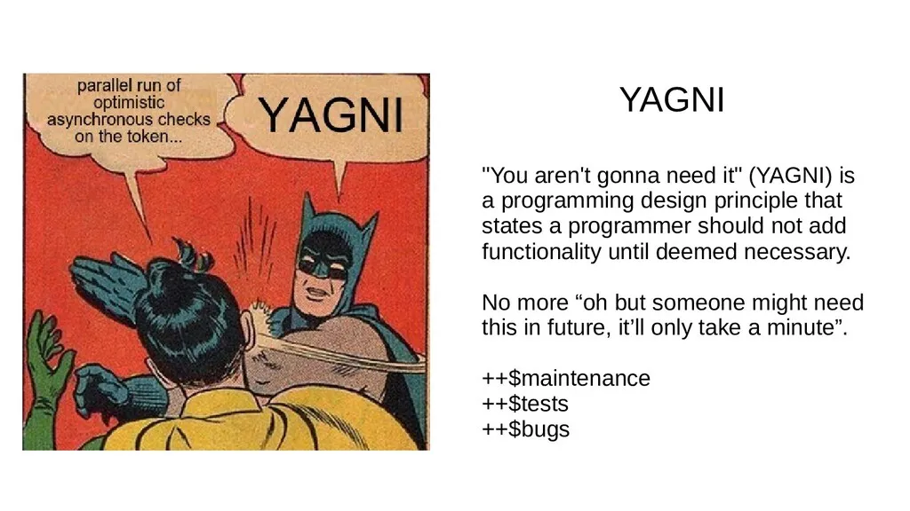

# Design Principles: Simple is the best
In this post, we are going to discuss **You Aren't Gonna Need It**. I find this principle useful for software development because the requirement is changing fast and this principle helps a lot.

Okay, let’s jump into the topic.

You Aren't Gonna Need It (YAGNI) is a design principle of Extreme Programming. This principle expresses the idea:

>Always implement things when you **actually** need them, never when you just **foresee** that you may need them.

That said, you shouldn’t make any assumptions to predict the future product requirement. Especially working in a fast-growing company, the software keeps iterating and the product requirement keeps changing. If you make a prediction on product requirements and develop your predicted requirement into the feature, probably the feature is over-engineered.

Over-engineering will make your solution much more complicated and take a lot of time to implement the solution when compared to a simple and naive solution. If there is a simple and straightforward approach that can solve the problem, why not just adopt it? Over designing a feature can slow down the team development velocity and productivity. Also, it makes other team members hard to understand the solution because you made some assumptions about your solution but others do not have those assumptions.

If now the product requirements changed and it breaks your assumptions, your efforts on this over-engineered feature will be wasted and it takes a lot of time to correct the behavior.

With YAGNI, we never predict product requirements and keep everything as simple as possible. We only address the requirements that we know about and do only absolutely necessary things to avoid waste. Adopting this principle can increase the maintainability and easier to support and revise the code in the future. If things change, we can update the behavior easily, or else throw it away in the worst case. It does not hurt too much on our development and we will not waste a lot of unnecessary efforts on the software development process.

>Another similar idea: KISS Principle
>Read more: https://en.wikipedia.org/wiki/KISS_principle